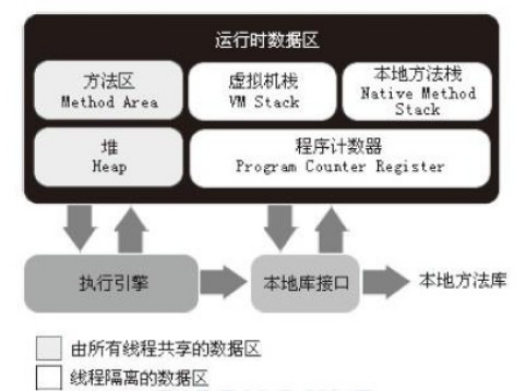
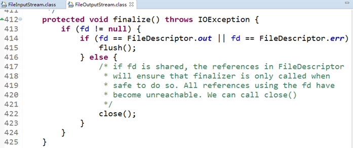

# 第七章 面向对象的高级特性

# 第七章 面向对象的高级特性

提交要有格式来提交的  OOP-高级特性

修饰符的学习围绕三个问题：

（1）单词的意思

（2）可以修饰什么？

（3）用它修饰后有什么不同？

单词的意思

可以修饰什么

用它修饰后有什么不同？


## 7.1 关键字：final

final：最终的

用法：

（1）修饰类（包括外部类、内部类类）

表示这个类不能被继承，没有子类

修饰类 外部类 内部类 

表示这个类不能被继承，没有子类

（2）修饰方法

表示这个方法不能被重写

方法不能被重写

（3）修饰变量（成员变量（类变量、实例变量），局部变量）

表示这个变量的值不能被修改

值不能被修改 

注意：如果某个成员变量用final修饰后，也得手动赋值，而且这个值一旦赋完，就不能修改了，即没有set方法

我们手动赋值 赋值完了就不能修改了 没有set方法 修改

我们可以获取这个值 

## 7.2 关键字：native

native：本地的，原生的
用法：

​	只能修饰方法

​	表示这个方法的方法体代码不是用Java语言实现的。

​	但是对于Java程序员来说，可以当做Java的方法一样去正常调用它，或者子类重写它。

只能修饰方法 表示这个方法的方法体代码不是用Java语言实现

JVM内存的管理：




方法区：类的信息、常量、静态变量、动态编译生成的字节码信息

虚拟机栈：Java语言实现的方法的局部变量

本地方法栈：非Java语言实现的方法的局部变量，即native方法执行时的内存区域

堆：new出来的对象

程序计数器：记录每一个线程目前执行到哪一句指令

方法区 虚拟机栈 本地方法栈 堆 程序计数器 

## 7.3 关键字：static

static：静态的

用法：

1、成员方法：我们一般称为静态方法或类方法

（1）不能被重写

（2）被使用

本类中：其他方法中可以直接使用它

其他类中：可以使用“类名.方法"进行调用，也可以使用"对象名.方法"，推荐使用“类名.方法"

（3）在静态方法中，我们不能出现：this，super，非静态的成员

类方法 不能被重写 

2、成员变量：我们一般称为静态变量或类变量

（1）静态变量的值是该类所有对象共享的

（2）静态变量存储在方法区

（3）静态变量对应的get/set也是静态的

（4）静态变量与局部变量同名时，就可以使用“类名.静态变量"进行区分

修饰static 成员变量    静态变量或类变量

静态变量的值该类所有对象共享的 

静态变量存储在方法区


3、内部类：之后再写 

4、代码块：静态代码块

5、静态导入（JDK1.5引入）

没有静态导入

```java
package com.awen.utils;

public class Utils{
    public static final int MAX_VALUE = 1000;
    public static void test(){
        //...
    }
}


```

```java
package com.awen.test;

import com.awen.utils;

public class Test{
    public static void main(String[] args){
        System.out.println(Utils.MAX_VALUE);
        Utils.test();
    }
}
```

使用静态导入

```java
package com.awen.utils;

public class Utils{
    public static final int MAX_VALUE = 1000;
    public static void test(){
        //...
    }
}
```

```java
package com.awen.test;

import static com.awen.utils.Utils.*;

public class Test{
    public static void main(String[] args){
        System.out.println(MAX_VALUE);
        test();
    }
}
```


## 7.4 静态代码块

1、语法格式：

```java
【修饰符】 class 类名{
    static{
        静态代码块;
    }
}
```

2、作用：

协助完成类初始化，可以为类变量赋值。


3、类初始化<clinit>()

类的初始化有：

①静态变量的显式赋值代码

②静态代码块中代码

其中①和②按顺序执行

注意：类初始化方法，一个类只有一个


4、类的初始化的执行特点：

（1）每一个类的<clinit>()只执行一次

（2）如果一个子类在初始化时，发现父类也没有初始化，会先初始化父类

（3）如果既要类初始化又要实例化初始化，那么一定是先完成类初始化的


## 7.5  变量的分类与区别

1、变量按照数据类型分：

（1）基本数据类型的变量，里面存储数据值

（2）引用数据类型的变量，里面存储对象的地址值

基本数据类型的变量 里面存储数据值的

引用数据类型的变量 里面存储对象的地址值


```java
int a = 10;//a中存储的是数据值

Student stu = new Student();//stu存储的是对象的地址值
int[] arr = new int[5];//arr存储的是数组对象的地址值
String str = "hello";//str存储的是"hello"对象的地址值

```


2、变量按照声明的位置不同：

（1）成员变量

（2）局部变量


3、成员变量与局部变量的区别

（1）声明的位置不同

成员变量：类中方法外

局部变量：（1）方法的()中，即形参（2）方法体的{}的局部变量（3）代码块{}中

（2）存储的位置不同

成员变量：

​	如果是静态变量（类变量），在方法区中

​	如果是非静态的变量（实例变量），在堆中

 局部变量：栈

方法区 静态变量（类变量）
堆 非静态的变量（实例变量）
局部变量：栈

（3）修饰符不同

成员变量：4种权限修饰符、static、final。。。。

局部变量：只有final


（4）生命周期

成员变量：

​	如果是静态变量（类变量），和类相同

​	如果是非静态的变量（实例变量），和所属的对象相同，每一个对象是独立

局部变量：每次执行都是新的

生命周期   类、对象、执行

（5）作用域

成员变量：

​	如果是静态变量（类变量），在本类中随便用，在其他类中使用“类名.静态变量" 类名.静态变量  

​	如果是非静态的变量（实例变量），在本类中只能在非静态成员中使用，在其他类中使用“对象名.非静态的变量" 对象名.静态变量

局部变量：有作用域   局部变量作用域看情况吧

## 7.7  根父类 java.lang.Object

根父类java.lang.Object

Object类是所有Java类的根父类

根父类

```java
如果在类的声明中未使用extends关键字指明其父类，则默认父类为Object类
public class Person {
	...
}
	等价于：
public class Person extends Object {
...
}

```

根父类

根据继承的特点

（1）父类中所有的属性和方法都会继承到子类中，或者说所有对象都具有Object类的方法，包括数组对象
（2）所有的子类都会调用它的构造器，super()

根据多态的特性

（1）Object类型的引用变量可以接收任何类型的对象
Object obj=new Person();
Object obj = “hello”;

...

（2）Object类型的形参可以接收任何类型的实参
例如：void method(Object obj){}
调用：method(new Person());
      method(new Computer());
      method("hello");
      method(null);

（3）数组的多态性：当数组的元素类型是Object时，表示这个数组可以存放任意类型的对象

Object[] object = new Object[5];

1、java.lang.Object类是类层次结构的根父类。包括数组对象。

（1）Object类中声明的所有的方法都会被继承到子类中，那么即所有的对象，都拥有Object类中的方法

（2）每一个对象的创建，最终都会调用到Object实例初始化方法<init>()

（3）Object类型变量、形参、数组，可以存储任意类型的对象


2、Object类的常用方法


（1）public String toString()：

①默认情况下，返回的是“对象的运行时类型 @ 对象的hashCode值的十六进制形式"

②通常是建议重写，如果在eclipse中，可以用Alt +Shift + S-->Generate toString()

③如果我们直接System.out.println(对象)，默认会自动调用这个对象的toString()

（2）public final Class<?> getClass()：获取对象的运行时类型

（3）protected void finalize()：当对象被GC确定为要被回收的垃圾，在回收之前由GC帮你调用这个方法。而且这个方法只会被调用一次。子类可以选择重写。

（4）public int hashCode()：返回每个对象的hash值。

规定：①如果两个对象的hash值是不同的，那么这两个对象一定不相等；

​	②如果两个对象的hash值是相同的，那么这两个对象不一定相等。

主要用于后面当对象存储到哈希表等容中时，为了提高性能用的。

（5）public boolean equals(Object obj)：用于判断当前对象this与指定对象obj是否“相等”

①默认情况下，equals方法的实现等价于与“==”，比较的是对象的地址值

②我们可以选择重写，重写有些要求：

A：如果重写equals，那么一定要一起重写hashCode()方法，因为规定：

​	a：如果两个对象调用equals返回true，那么要求这两个对象的hashCode值一定是相等的；

​	b：如果两个对象的hashCode值不同的，那么要求这个两个对象调用equals方法一定是false；

​	c：如果两个对象的hashCode值相同的，那么这个两个对象调用equals可能是true，也可能是false

B：如果重写equals，那么一定要遵循如下几个原则：

​	a：自反性：x.equals(x)返回true

​	b：传递性：x.equals(y)为true, y.equals(z)为true，然后x.equals(z)也应该为true

​	c：一致性：只要参与equals比较的属性值没有修改，那么无论何时调用结果应该一致

​	d：对称性：x.equals(y)与y.equals(x)结果应该一样

​	e：非空对象与null的equals一定是false

参考资料
[搞定Java核心技术](https://www.bilibili.com/video/BV1R5411t7Ze)


#### ==与equals()方法

基础数据类型

引用数据类型

1、==运算符

（1）基本数据类型比较值:只要两个变量的值相等，即为true

>  注意：当基本数据类型使用“==”进行比较时，符号两边的数据必须类型兼容（类型相同或可自动类型转换），否则编译出错；

 

```java
public class TestDemo {
    public static void main(String[] args) {
        double d = 2.0;
        int i = 2;
        int j = 2;
        String str = "2";
        System.out.println(i == j);//true
        System.out.println(i == d);//true

        //编译出错  编译都过不了
//        System.out.println(str == i);//Operator '==' cannot be applied to 'java.lang.String', 'int'
//        System.out.println(str == d);//Operator '==' cannot be applied to 'java.lang.String', 'double'
    }
}
```


（2）引用类型比较引用：比较两个对象的地址值，两个引用变量指向同一个对象的堆空间时，才为true

Person p1=new Person();  

Person p2=new Person();

if(p1==p2)  //false

p1=p2;//如果有这样的赋值语句后 if(p1==p2)  //true

 ```java
public class Person {
    private String name;
    private int age;

    public static void main(String[] args) {
        Person p1 = new Person();
        Person p2 = new Person();
        System.out.println(p1 == p2);//false
        p1 = p2;
        System.out.println(p1 == p2);//true
    }
}

 ```


注意：当引用类型使用“==”进行比较时，符号两边的数据类型必须兼容（类型相同或有父子类关系），否则编译出错；

Person p=new Person();

String str="hello";

if(p==str)//错误，p和String类型不兼容，Person和String类型无父子类关系

 ```java
public class Person {
    private String name;
    private int age;

    public static void main(String[] args) {
        Person p1 = new Person();
        Person p2 = new Person();
        System.out.println(p1 == p2);//false
        p1 = p2;
        System.out.println(p1 == p2);//true

        Person p = new Person();
        String str = "hello";
//        System.out.println(p == str);//错误，p和String类型不兼容，Person和String类型无父子类关系
    }
}

 ```


Student stu = new Student();//Student extends Person

if(p==stu)//编译通过

 ```java
public class Student  extends Person{
    public static void main(String[] args) {
        Person person = new Person();
        Student student = new Student();//Student extends Person
        
        //编译通过
        System.out.println(person == student);//false
    }
}
 ```


2、equals方法

格式:obj1.equals(obj2)

（1）equals()：所有类都继承了Object，也就获得了equals()方法。

（2）自定义类可以重写equals方法

注意：如果一个类型没有重写过equals方法，那么调用equals等价于==

说明：当用equals()方法进行比较时，对类File、String、Date及包装类（Wrapper Class）来说，是比较类型及内容；原因是在这些类中重写了Object类的equals()方法。

重写equals()方法的原则：

l 对称性：如果x.equals(y)返回是“true”，那么y.equals(x)也应该返回是“true”。

l 自反性：x.equals(x)必须返回是“true”。

l 类推性：如果x.equals(y)返回是“true”，而且y.equals(z)返回是“true”，那么z.equals(x)也应该返回是“true”。

l 一致性：如果x.equals(y)返回是“true”，只要x和y内容一直不变，不管你重复x.equals(y)多少次，返回都是“true”。

l 任何情况下，x.equals(null)，永远返回是“false”；x.equals(和x不同类型的对象)永远返回是“false”。

 ```java
public class Student  extends Person{
    public static void main(String[] args) {
        Person person = new Person();
        Student student = new Student();//Student extends Person

        //编译通过
        System.out.println(person == student);//false
        System.out.println(person.equals(student));//false

        System.out.println("-----------");
        String str1 = "hello";
        String str2 = "hello";
        String str3 = new String("hello");
        System.out.println(str1 == str2);//true
        System.out.println(str1 == str3);//false
        System.out.println(str1.equals(str2));//true
        System.out.println(str1.equals(str3));//true

        System.out.println("------------");
        String str4 = "java";
        System.out.println(str4 == "java");//true
        System.out.println(str4.equals("java"));//true
        System.out.println("java".equals(str4));//true
        System.out.println(str4.equals(str4));//true
        System.out.println(str4.equals(null));//false
        System.out.println("j".equals('j'));//false


    }
}

 ```


#### 2、hashcode方法

l 如果两个对象的hashCode值不相等，那么这两个对象一定不相等，即调用==和equals返回true

l 如果两个对象的hashCode值相等，那么这两个对象可能相等，可能不相等，即调用==和equals方法可能返回true，可能false

l 如果两个对象调用==或equals相等，那么这两个对象的hashCode值一定相等。


```java
public class TestHashCode {
    public static void main(String[] args) {
        String s1 = "Aa";
        String s2 = "BB";
        System.out.println(s1.hashCode());//2112
        System.out.println(s2.hashCode());//2112
        System.out.println(s1 == s2);
        System.out.println(s1.equals(s2));
        System.out.println(System.identityHashCode(s1));//460141958
        System.out.println(System.identityHashCode(s2));//1163157884

        String s3 = "java";
        String s4 = "java";
        String s5 = new String("java");

        System.out.println(s3 == s4);//true
        System.out.println(s3.equals(s4));//true
        System.out.println(s3 == s5);//false
        System.out.println(s5.equals(s3));//true
        System.out.println(s3.hashCode());//3254818
        System.out.println(s4.hashCode());//3254818
        System.out.println(s5.hashCode());//3254818
        System.out.println(System.identityHashCode(s3));//1956725890
        System.out.println(System.identityHashCode(s4));//1956725890
        System.out.println(System.identityHashCode(s5));//356573597
    }
}
```

根父类java.lang.Object

Object类是所有Java类的根父类 

Object类的常用方法

Object类中声明的所有的方法都会被继承到子类中，那么即所有的对象，都拥有Object类中的方法


 public int hashCode()：返回每个对象的hash值。

规定：①如果两个对象的hash值是不同的，那么这两个对象一定不相等；

​	②如果两个对象的hash值是相同的，那么这两个对象不一定相等。

主要用于后面当对象存储到哈希表等容中时，为了提高性能用的。

#### 3、toString()方法

1、默认从Object类继承的toString()方法返回的是

getClass().getName() + '@' + Integer.toHexString(hashCode())

即该对象的类名称@该对象hashcode哈希码的无符号十六进制表示

 

2、在进行String与其它类型数据的连接操作时，自动调用toString()方法

​    Date now=new Date();

​    System.out.println(“now=”+now); 相当于

 System.out.println(“now=”+now.toString()); 

 

3、可以根据需要在用户自定义类型中重写toString()方法

如String 类重写了toString()方法，返回字符串的值。

​    s1=“hello”;

​    System.out.println(s1);//相当于System.out.println(s1.toString());

 

4、基本类型数据转换为String类型时，调用了对应包装类的toString()方法

int a=10;  System.out.println(“a=”+a);

#### 4、finalize()方法

A：这个方法不是程序员手动调用的，而是垃圾回收器调用，当该对象被垃圾回收器回收之前调用（留临终遗言）

B：每一个对象的finalize方法只能被调用一次

  因为如果某个对象重写的finalize()中有一个变量再次引用了this当前对象，那么当前对象就复活了，垃圾回收器这次就不能将其回收。

  但是当它下次再变成垃圾后，垃圾回收器再碰到它，就直接回收，不再调用它的finalize()方法。

C：一般情况下不需要重写，只有这个类是表示某种连接资源时，例如FileInputStream或FileOutputStream，可能需要重写，使得会被回收之前，以配置系统资源或执行其他清除。



## 7.8 关键字：abstract

面向对象的基本特性 封装、继承、多态
面向对象的特征：封装、继承、多态、抽象

1、什么时候会用到抽象方法和抽象类？

当声明父类的时候，在父类中某些方法的方法体的实现不能确定，只能由子类决定。但是父类中又要体现子类的共同的特征，即它要包含这个方法，为了统一管理各种子类的对象，即为了多态的应用。

那么此时，就可以选择把这样的方法声明为抽象方法。如果一个类包含了抽象方法，那么这个类就必须是个抽象类。


2、抽象类的语法格式

```java
【权限修饰符】 abstract class 类名{
    
}
【权限修饰符】 abstract class 类名 extends 父类{
    
}
```

3、抽象方法的语法格式

```java
【其他修饰符】 abstract 返回值类型  方法名(【形参列表】);
```

抽象方法没有方法体


4、抽象类的特点

（1）抽象类不能直接实例化，即不能直接new对象
抽象类不能直接实例化 即不能直接new对象
（2）抽象类就是用来被继承的，那么子类继承了抽象类后，必须重写所有的抽象方法，否则这个子类也得是抽象类
抽象类就是用来被继承的，那么子类继承了抽象类后，必须重写所有的抽象方法，否则这个子类也得是抽象类
（3）抽象类也有构造器，这个构造的作用不是创建抽象类自己的对象用的，给子类在实例化过程中调用；
抽象类也有构造器 这个构造的作用不是创建抽象类自己的对象用的 给子类在实例化过程中调用
（4）抽象类也可以没有抽象方法，那么目的是不让你创建对象，让你创建它子类的对象
抽象类也可以没有抽象方法，那么目的是不让你创建对象，让你创建它子类的对象
（5）抽象类的变量与它子类的对象也构成多态引用
抽象类的变量与它子类的对象也构成多态引用

5、不能和abstract一起使用的修饰符？

（1）final：和final不能一起修饰方法和类

（2）static：和static不能一起修饰方法

（3）native：和native不能一起修饰方法

（4）private：和private不能一起修饰方法


## 7.9 接口


1、接口的概念

接口是一种标准。注意关注行为标准（即方法）。
接口是一种标准 注意关注行为标准（即方法）
面向对象的开发原则中有一条：面向接口编程

面向接口编程

共有的特性 

2、接口的声明格式

```java
【修饰符】 interface 接口名{
    接口的成员列表;
}
```

3、类实现接口的格式

```java
【修饰符】 class 实现类  implements 父接口们{
    
}

【修饰符】 class 实现类 extends 父类 implements 父接口们{
    
}
```

4、接口继承接口的格式

```java
【修饰符】 interface 接口名 extends 父接口们{
    接口的成员列表;
}
```

接口继承接口 interface extends 
5、接口的特点

（1）接口不能直接实例化，即不能直接new对象

（2）只能创建接的实现类对象，那么接口与它的实现类对象之间可以构成多态引用。

（3）实现类在实现接口时，必须重写所有抽象的方法，否则这个实现类也得是抽象类。

（4）Java规定类与类之间，只能是单继承，但是Java的类与接口之间是多实现的关系，即一个类可以同时实现多个接口

（5）Java还支持接口与接口之间的多继承。


6、接口的成员

JDK1.8之前：

（1）全局的静态的常量：public static final，这些修饰符可以省略

（2）公共的抽象方法：public abstract，这些修饰符也可以省略

JDK1.8之后：

（3）公共的静态的方法：public static ,这个就不能省略了

（4）公共的默认的方法：public default，这个就不能省略了


7、默认方法冲突问题

（1） 当一个实现类同时实现了两个或多个接口，这个多个接口的默认方法的签名相同。

解决方案：

方案一：选择保留其中一个

```java
接口名.super.方法名(【实参列表】);
```

方案二：完全重写


（2）当一个实现类同时继承父类，又实现接口，父类中有一个方法与接口的默认方法签名相同

解决方案：

方案一：默认方案，保留父类的

方案二：选择保留接口的

```java
接口名.super.方法名(【实参列表】);
```

方案三：完全重写


8、示例代码

```java
public interface Flyable{
	long MAX_SPEED = 7900000;
    void fly();
}
```

```java
public class Bird implements Flyable{
    public void fly(){
        //....
    }
}
```

9、常用的接口

（1）java.lang.Comparable接口：自然排序

​	抽象方法：int compareTo(Object obj)

（2）java.util.Comparator接口：定制排序

​	抽象方法：int compare(Object obj1 ,Object obj2)

（3）示例代码

如果员工类型，默认顺序，自然顺序是按照编号升序排列，那么就实现Comparable接口

```java
class Employee implements Comparable{
    private int id;
    private String name;
    private double salary;
    
    //省略了构造器，get/set,toString
    
    @Override
    public int compareTo(Object obj){
        return id - ((Employee)obj).id;
    }
}
```

如果在后面又发现有新的需求，想要按照薪资排序，那么只能选择用定制排序，实现Comparator接口

```java
class SalaryComparator implements Comparator{
    public int compare(Object o1, Object o2){
        Employee e1 = (Employee)o1;
        Employee e2 = (Employee)o2;
        if(e1.getSalary() > e2.getSalary()){
            return 1;
        }else if(e1.getSalary() < e2.getSalary()){
            return -1;
        }
        return 0;
    }
}
```


## 7.10 内部类

1、内部类的概念

声明在另外一个类里面的类就是内部类。


2、内部类的4种形式

（1）静态内部类

（2）非静态成员内部类

（3）有名字的局部内部类

（4）匿名内部类


### 7.10.1 匿名内部类

1、语法格式：

```java
//在匿名子类中调用父类的无参构造
new 父类(){
    内部类的成员列表
}

//在匿名子类中调用父类的有参构造
new 父类(实参列表){
    内部类的成员列表
}

//接口没有构造器，那么这里表示匿名子类调用自己的无参构造，调用默认父类Object的无参构造
new 父接口名(){
    
}
```

2、匿名内部类、匿名对象的区别？

```java
System.out.println(new Student("张三"));//匿名对象

Student stu = new Student("张三");//这个对象有名字，stu

//既有匿名内部类，又是一个匿名的对象
new Object(){
    public void test(){
        .....
    }
}.test();

//这个匿名内部类的对象，使用obj这个名字引用它，既对象有名字，但是这个Object的子类没有名字
Object obj = new Object(){
    public void test(){
        .....
    }
};
```

3、使用的形式

（1）示例代码：继承式

```java
abstract class Father{
    public abstract void test();
}
class Test{
    public static void main(String[] args){
        //用父类与匿名内部类的对象构成多态引用
        Father f = new Father(){
            public void test(){
                System.out.println("用匿名内部类继承了Father这个抽象类，重写了test抽象方法")
            }
        };
        f.test();
    }
}
```

（2）示例代码：实现式

```java
interface Flyable{
    void fly();
}
class Test{
    public static void main(String[] args){
        //用父接口与匿名内部类的对象构成了多态引用
        Flyable f = new Flyable(){
            public void fly(){
                System.out.println("用匿名内部类实现了Flyable这个接口，重写了抽象方法");
            }
        };
        f.fly();
    }
}
```

（3）示例代码：用匿名内部类的匿名对象直接调用方法

```java
new Object(){
    public void test(){
        System.out.println("用匿名内部类的匿名对象直接调用方法")
    }
}.test();
```

（4）示例代码：用匿名内部类的匿名对象直接作为实参

```java
Student[] all = new Student[3];
all[0] = new Student("张三",23);
all[1] = new Student("李四",22);
all[2] = new Student("王五",20);

//用匿名内部类的匿名对象直接作为实参
//这个匿名内部类实现了Comparator接口
//这个匿名内部类的对象，是定制比较器的对象
Arrays.sort(all, new Comparator(){
    public int compare(Obeject o1, Object o2){
        Student s1 = (Student)o1;
        Student s2 = (Student)o2;
        return s1.getAge() - s2.getAge();
    }
});
```

### 7.10.2  静态内部类

1、语法格式

```java
【修饰符】 class 外部类名  【extends 外部类的父类】 【implements 外部类的父接口们】{
	【其他修饰符】 static class  静态内部类 【extends 静态内部类自己的父类】 【implements 静态内部类的父接口们】{
        静态内部类的成员列表;
	}
	
	外部类的其他成员列表;
}
```


2、 使用注意事项

（1）包含成员是否有要求：

​		可以包含类的所有成员

（2）修饰符要求：

* ​		权限修饰符：4种
* ​		其他修饰符：abstract、final

（3）使用外部类的成员上是否有要求

* ​		只能使用外部类的静态成员

（4）在外部类中使用静态内部类是否有要求

* ​		正常使用

（5）在外部类的外面使用静态内部类是否有要求

```java
（1）如果使用的是静态内部类的静态成员
		外部类名.静态内部类名.静态成员
（2）如果使用的是静态内部类的非静态成员
		①先创建静态内部类的对象
		外部类名.静态内部类名 对象名 = new 外部类名.静态内部类名(【实参列表】);
		②通过对象调用非静态成员
		对象名.xxx
```

（6）字节码文件形式：外部类名$静态内部类名.class


3、示例代码

```java
class Outer{
    private static int i = 10;
    static class Inner{
        public void method(){
            //...
            System.out.println(i);//可以
        }
        public static void test(){
            //...
            System.out.println(i);//可以
        }
    }
    
    public void outMethod(){
        Inner in = new Inner();
        in.method();
    }
    public static void outTest(){
        Inner in = new Inner();
        in.method();
    }
}
class Test{
    public static void main(String[] args){
        Outer.Inner.test();
        
        Outer.Inner in = new Outer.Inner();
        in.method();
    }
}
```


### 7.10.3  非静态内部类

1、语法格式

```java
【修饰符】 class 外部类名  【extends 外部类的父类】 【implements 外部类的父接口们】{
	【修饰符】 class  非静态内部类 【extends 非静态内部类自己的父类】 【implements 非静态内部类的父接口们】{
        非静态内部类的成员列表;
	}
	
	外部类的其他成员列表;
}
```


2、 使用注意事项

（1）包含成员是否有要求：

​	不允许出现静态的成员

（2）修饰符要求

​	权限修饰符：4种

​	其他修饰符：abstract，final

（3）使用外部类的成员上是否有要求

​	都可以使用

（4）在外部类中使用非静态内部类是否有要求

​	在外部类的静态成员中不能使用非静态内部类

（5）在外部类的外面使用非静态内部类是否有要求

```java
//使用非静态内部类的非静态成员
//(1)创建外部类的对象
外部类名  对象名1 = new  外部类名(【实参列表】);

//(2)通过外部类的对象去创建或获取非静态内部类的对象
//创建
外部类名.非静态内部类名  对象名2 = 对象名1.new 非静态内部类名(【实参列表】);

//获取
外部类名.非静态内部类名  对象名2 = 对象名1.get非静态内部类对象的方法(【实参列表】);

//（3）通过非静态内部类调用它的非静态成员
对象名2.xxx
```

（6）字节码文件形式：外部类名$非静态内部类名.class


3、示例代码

```java
class Outer{
    private static int i = 10;
    private int j = 20;
    class Inner{
        public void method(){
            //...
            System.out.println(i);//可以
            System.out.println(j);//可以
        }
    }
    
    public void outMethod(){
        Inner in = new Inner();
        in.method();
    }
    public static void outTest(){
       // Inner in = new Inner();//不可以
    }
    
    public Inner getInner(){
        return new Inner();
    }
}
class Test{
    public static void main(String[] args){
        Outer out = new Outer();
        
        Outer.Inner in1 = out.new Inner();     //创建   	
        in1.method();
        
        Outer.Inner in2 = out.getInner();	//获取
        in2.method();
    }
}
```


### 7.10.4  局部内部类

1、语法格式

```java
【修饰符】 class 外部类名  【extends 外部类的父类】 【implements 外部类的父接口们】{
	【修饰符】 返回值类型  方法名(【形参列表】){
        【修饰符】 class  局部内部类 【extends 局部内部类自己的父类】 【implements 局部内部类的父接口们】{
        	局部内部类的成员列表;
		}
	}	
	外部类的其他成员列表;
}
```


2、 使用注意事项

（1）包含成员是否有要求

​	不允许出现静态的成员

（2）修饰符要求

​	权限修饰符：不能

​	其他修饰符：abstract、final

（3）使用外部类的成员等上是否有要求

​	①使用外部类的静态成员：随便用

​	②使用外部类的非静态成员：能不能用要看所在的方法是否是静态的

​	③使用所在方法的局部变量：必须 final修饰的

（4）在外部类中使用局部内部类是否有要求

​	有作用域

（5）在外部类的外面使用局部内部类是否有要求

​	没法使用

（6）字节码文件形式：外部类名$编号局部内部类名.class


3、示例代码

```java
class Outer{
    private static int i = 10;
    private int j = 20;

    
    public void outMethod(){
        class Inner{
            public void method(){
                //...
                System.out.println(i);//可以
                System.out.println(j);//可以
            }
   		}
        Inner in = new Inner();
        in.method();
    }
    public static void outTest(){
        final int k = 30;
       class Inner{
            public void method(){
                //...
                System.out.println(i);//可以
                System.out.println(j);//不可以
                System.out.println(k);//可以
            }
   		}
        Inner in = new Inner();
        in.method();
    }
}
```

