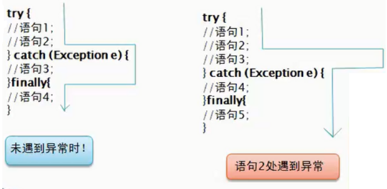

第九章 异常

# 第九章 异常

## 9.1 异常的类型的体系结构

1、异常系列的超父类：java.lang.Throwable

（1）只有它或它子类的对象，才能被JVM或throw语句“抛”出

（2）也只有它或它子类的对象，才能被catch“捕获”


2、Throwable分为两大派别

（1）Error：严重的错误，需要停下来重新设计、升级解决这个问题

（2）Exception： 一般的异常，可以通过判断、检验进行避免，或者使用try...catch进行处理


3、Exception又分为两大类

（1）运行时异常：

​	它是RuntimeException或它子类的对象。

​	这种类型的异常，编译器不会提醒你，要进行throws或try...catch进行处理，但是运行时可能导致崩溃。

（2）编译时异常：

​	异常除了运行时异常以外的都是编译时异常。

​	这种类型的异常，编译器是强制要求你，throws或try...catch进行处理，否则编译不通过。


4、列出常见的异常类型

（1）运行时异常

RuntimeException、NullPointerException（空指针异常），ClassCastException（类型转换异常），ArithmeticException（算术异常），NubmerFormatException（数字格式化异常），IndexOutOfBoundsException（下标越界异常）（ArrayIndexOutOfBoundsException（数组下标越界异常）、StringIndexOutOfBoundsException（字符串下标越界异常））、InputMisMatchException（输入类型不匹配异常）。。。。


（2）编译时异常

FileNotFoundException（文件找不到异常）、IOException（输入输出异常）、SQLException（数据库sql语句执行异常）。。。


## 9.2 异常的处理

1、在当前方法中处理：try...catch...finally

```java
//形式一：try...catch
try{
    可能发生异常的代码
}catch(异常类型  异常名e){
    处理异常的代码（一般都是打印异常的信息的语句）
}catch(异常类型  异常名e){
    处理异常的代码（一般都是打印异常的信息的语句）
}。。。


//形式二：try...finally
try{
    可能发生异常的代码
}finally{
    无论try中是否有异常，也不管是不是有return，都要执行的部分
}

//形式三：try..catch..finally
try{
    可能发生异常的代码
}catch(异常类型  异常名e){
    处理异常的代码（一般都是打印异常的信息的语句）
}catch(异常类型  异常名e){
    处理异常的代码（一般都是打印异常的信息的语句）
}。。。
finally{
    无论try中是否有异常，也不管catch是否可以捕获异常，也不管try和catch中是不是有return，都要执行的部分
}
```

执行特点：

（1）如果try中的代码没有异常，那么try中的代码会正常执行，catch部分就不执行，finally中会执行

（2）如果try中的代码有异常，那么try中发生异常的代码的后面就不执行了，找对应的匹配的catch分支执行，finally中会执行




2、finally与return混合使用时

（1）如果finally中有return，一定从finally中的return返回。

此时try和catch中的return语句，执行了一半，执行了第一个动作。所以，finally中的return语句会覆盖刚刚的返回值


return 返回值; 语句有两个动作：（1）把返回值放到“操作数栈”中，等当前方法结束后，这个“操作数栈”中的值会返回给调用处（2）结束当前方法的执行


（2）如果finally中没有return，finally中的语句会执行，但是不影响最终的返回值

即try和catch中的return语句两步拆开来走，先把（1）把返回值放到“操作数栈”中，（2）然后走finally中的语句（3）再执行return后半个动作，结束当前方法


3、在当前方法中不处理异常，明确要抛给调用者处理，使用throws

语法格式：

```java
【修饰符】 返回值类型  方法名(【形参列表】) throws 异常列表{
    
}
```

此时调用者，就知道需要处理哪些异常。


方法的重写的要求：

（1）方法名：相同

（2）形参列表：相同

（3）返回值类型：

​	基本数据类型和void：相同

​	引用数据类型：<=

（4）修饰符：

​	权限修饰符：>=

​	其他修饰符：static，final，private不能被重写

（5）throws：<=


方法的重载：

（1）方法名：相同

（2）形参列表：必须不同

（3）返回值类型：无关

（4）修饰符：无关

（5）throws：无关


## 9.3 手动抛出异常：throw

```java
throw 异常对象;

//例如：
throw new AccountException("xxx");
```

throw抛出来的异常对象，和JVM抛出来的异常对象一样，也要用try..catch处理或者throws。

如果是运行时异常，编译器不会强制要求你处理，如果是编译时异常，那么编译器会强制要求你处理。


## 9.4  自定义异常

1、必须继承Throwable或它的子类

我们见到比较多的是继承RuntimeException和Exception.

如果你继承RuntimeException或它的子类，那么你自定义的这个异常就是运行时异常。编译器就不会提醒你处理。

如果你继承Exception，那么它属于编译时异常，编译器会强制你处理。

2、建议大家保留两个构造器

```java
//无参构造
public 自定义异常名(){
    
}

//有参构造
public 自定义异常名(String message){
    super(message);
}
```

3、自定义异常对象，必须手动抛出，用throw抛出


## 9.5 关于异常的几个方法

（1）e.printStackTrace()：打印异常对象的详细信息，包括异常类型，message，堆栈跟踪信息。这个对于调试，或者日志跟踪是非常有用的

（2）e.getMessage()：只是获取异常的message信息


关于异常信息的打印：

用System.err打印和用e.printStackTrace()都是会标记红色的突出。

用System.out打印，当成普通信息打印。

这两个打印是两个独立的线程，顺序是不能精确控制的。