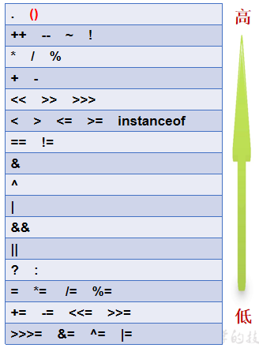

# 第二章 Java的基础语法

## 2.1 标识符

简单的说，凡是程序员自己命名的部分都可以称为标识符。

即给类、变量、方法、包等命名的字符序列，称为标识符。


1、标识符的命名规则

（1）Java的标识符只能使用26个英文字母大小写，0-9的数字，下划线_，美元符号$

（2）不能使用Java的关键字（包含保留字）和特殊值

（3）数字不能开头

（4）不能包含空格

（5）严格区分大小写


2、标识符的命名规范

（1）见名知意

（2）类名、接口名等：每个单词的首字母都大写，形式：XxxYyyZzz，

例如：HelloWorld，String，System等

（3）变量、方法名等：从第二个单词开始首字母大写，其余字母小写，形式：xxxYyyZzz，

例如：age,name,bookName,main

（4）包名等：每一个单词都小写，单词之间使用点.分割，形式：xxx.yyy.zzz，

例如：java.lang

（5）常量名等：每一个单词都大写，单词之间使用下划线_分割，形式：XXX_YYY_ZZZ，

例如：MAX_VALUE,PI


## 2.2 变量

### 2.2.1 变量的概念

变量的作用：用来存储数据，代表内存的一块存储区域，变量中的值是可以改变的。

### 2.2.2 变量的三要素

1、数据类型

2、变量名

3、值

### 2.2.3 变量的使用应该注意什么？

1、先声明后使用

> 如果没有声明，会报“找不到符号”错误

2、在使用之前必须初始化

> 如果没有初始化，会报“未初始化”错误

3、变量有作用域

> 如果超过作用域，也会报“找不到符号”错误

4、在同一个作用域中不能重名


### 2.2.4 变量的声明和赋值、使用的语法格式？

1、变量的声明的语法格式：

```java
数据类型  变量名;
例如：
int age;
String name;
double weight;
char gender;
boolean isMarry;
```

2、变量的赋值的语法格式：

```java
变量名 = 值;
例如：
age = 18;
name = "柴林燕"; //字符串的值必须用""
weight = 44.4;
gender = '女';//单字符的值必须使用''
isMarry = true;
```

3、变量的使用的语法格式：

```java
通过变量名直接引用

例如：
(1)输出变量的值
System.out.print(name);
System.out.print("姓名：" + name);//""中的内容会原样显示
System.out.print("name = " + name);
(2)计算
age = age + 1;
```

# 2.3 数据类型

### 2.3.1 Java数据类型的分类

1、基本数据类型

​	8种：整型系列（byte,short,int,long）、浮点型(float,double)、单字符型（char）、布尔型（boolean）

2、引用数据类型

​	类、接口、数组、枚举.....

### 2.3.2 Java的基本数据类型

1、整型系列

（1）byte：字节类型

占内存：1个字节

存储范围：-128~127

（2）short：短整型类型

占内存：2个字节

存储范围：-32768~32767

（3）int：整型

占内存：4个字节

存储范围：-2的31次方 ~ 2的31次方-1

（4）long：整型

占内存：8个字节

存储范围：-2的63次方 ~ 2的63次方-1

> 注意：如果要表示某个常量数字它是long类型，那么需要在数字后面加L


2、浮点型系列（小数）

（1）float：单精度浮点型

占内存：4个字节

精度：科学记数法的小数点后6~7位

> 注意：如果要表示某个常量数字是float类型，那么需要在数字后面加F或f

（2）double：双精度浮点型

占内存：8个字节

精度：科学记数法的小数点后15~16位


3、单字符类型

char：字符类型

占内存：2个字节

Java中使用的字符集：Unicode编码集

字符的三种表示方式：

（1）'一个字符'

例如：'A'，'0'，'尚'

（2）转义字符

```
\n：换行
\r：回车
\t：Tab键
\\：\
\"：”
\'：
\b：删除键Backspace
```

（3）\u字符的Unicode编码值的十六进制型

例如：\u5c1a代表'尚'


4、布尔类型

boolean：只能存储true或false

### 2.3.3 进制（了解，可以暂时忽略）

1、进制的分类：

（1）十进制

​	数字组成：0-9

​	进位规则：逢十进一

（2）二进制

​	数字组成：0-1

​	进位规则：逢二进一

（3）八进制

​	数字组成：0-7

​	进位规则：逢八进一

（4）十六进制

​	数字组成：0-9，a~f（或A~F）

​	进位规则：逢十六进一


2、请分别用四种类型的进制来表示10，并输出它的结果：（了解）

（1）十进制：正常表示

System.out.println(10);

（2）二进制：0b或0B开头

System.out.println(0B10);

（3）八进制：0开头

System.out.println(010);

（4）十六进制：0x或0X开头

System.out.println(0X10);


3、为什么byte是-128~127？（理解）

1个字节：8位

0000 0001  ~  0111 111 ==> 1~127

1000 0001 ~ 1111 1111 ==> -127 ~ -1

0000 0000 ==>0

1000 0000 ==> -128（特殊规定）

> *解释：*计算机数据的存储（了解）
>
> *计算机数据的存储使用二进制补码形式存储，并且最高位是符号位，1是负数，0是正数。*
>
> *规定：正数的补码与反码、原码一样，称为三码合一；*
>
> ​	    *负数的补码与反码、原码不一样：*
>
> ​	   *负数的原码：把十进制转为二进制，然后最高位设置为1*
>
> ​	   *负数的反码：在原码的基础上，最高位不变，其余位取反（0变1,1变0）*
>
> ​	   *负数的补码：反码+1*
>
> *例如：byte类型（1个字节，8位）*
>
> *25 ==> 原码  0001 1001 ==> 反码  0001 1001 -->补码  0001 1001*
>
> *-25 ==>原码  1001 1001 ==> 反码1110 0110 ==>补码 1110 0111*
>
> 底层是用加法代替减法：-128==》-127-1==》-127+(-1)
>
> ​				       -127- -1 ==> -127 + 1


4、学生疑惑解答？

（1）为什么float（4个字节）比long（8个字节）的存储范围大？

（2）为什么double（8个字节）比float（4个字节）精度范围大？

因为float、double底层也是二进制，先把小数转为二进制，然后把二进制表示为科学记数法，然后只保存：

（1）符号位（2）指数位（3）尾数位

> *详见《float型和double型数据的存储方式.docx》*

### 2.3.4 基本数据类型的转换

1、自动类型转换

（1）当把存储范围小的值（常量值、变量的值、表达式计算的结果值）赋值给了存储范围大的变量时，

byte->short->int->long->float->double

​            char->

```java
int i = 'A';//char自动升级为int
double d = 10;//int自动升级为double
```


（2）当存储范围小的数据类型与存储范围大的数据类型一起混合运算时，会按照其中最大的类型运算

```java
int i = 1;
byte b = 1;
double d = 1.0;

double sum = i + b + d;//混合运算，升级为double
```

（3）当byte,short,char数据类型进行算术运算时，按照int类型处理

```java
byte b1 = 1;
byte b2 = 2;
byte b3 = (byte)(b1 + b2);//b1 + b2自动升级为int

char c1 = '0';
char c2 = 'A';
System.out.println(c1 + c2);//113 
```

（4）boolean类型不参与


2、强制类型转换

（1）当把存储范围大的值（常量值、变量的值、表达式计算的结果值）赋值给了存储范围小的变量时，需要强制类型转换

double->float->long->int->short->byte

​					   ->char

提示：有风险，可能会损失精度或溢出

```java
double d = 1.2;
int num = (int)d;//损失精度

int i = 200;
byte b = (byte)i;//溢出
```

（2）boolean类型不参与

（3）当某个值想要提升数据类型时，也可以使用强制类型转换

```java
int i = 1;
int j = 2;
double shang = (double)i/j;
```

提示：这个情况的强制类型转换是没有风险的。


### 2.3.5 特殊的数据类型转换

1、任意数据类型的数据与String类型进行“+”运算时，结果一定是String类型

```java
System.out.println("" + 1 + 2);//12
```


2、但是String类型不能通过强制类型()转换，转为其他的类型

```java
String str = "123";
int num = (int)str;//错误的
```


## 2.4 运算符

1、按照操作数个数的分类：

（1）一元运算符：操作数只有一个

例如：正号（+），负号（-），自增（++），自减（--），逻辑非（！），按位取反（~）

（2）二元运算符：操作数有两个

例如：加（+），减（-），乘（*），除（/），模（%）

​          大于（>），小于（<），大于等于（>=），小于等于（<=），等于（==），不等于（!=）

​	赋值（=，+=，-=，*=，/=，%=，>>=，<<=。。。）

​	 逻辑与（&），逻辑或（|），逻辑异或（^），短路与（&&），短路或（||）

​	左移（<<），右移（>>），无符号右移（>>>），按位与（&），按位或（|），按位异或（^）

（3）三元运算符：操作数三个

例如： ？ ：


2、Java基本数据类型的运算符：

（1）算术运算符

（2）赋值运算符

（3）比较运算符

（4）逻辑运算符

（5）条件运算符

（6）位运算符（难）

### 2.4.1 算术运算符

加法：+

减法：-

乘法：*

除法：/

> *注意：整数与整数相除，只保留整数部分*

取模：%   取余

> 注意：取模结果的正负号只看被模数

正号：+

负号：-

自增：++

自减：--

> **原则：自增与自减**
>
> **++/--在前的，就先自增/自减，后取值**
>
> **++/--在后的，就先取值，后自增/自减**
>
> 整个表达式的扫描，是从左往右扫描，如果后面的先计算的，那么前面的就暂时先放到“操作数栈”中

代码示例：

```java
int i = 1;
i++;//i=2

int j = 1;
++j;//j=2

int a = 1;
int b = a++;//(1)先取a的值“1”放操作数栈(2)a再自增,a=2(3)再把操作数栈中的"1"赋值给b,b=1

int m = 1;
int n = ++m;//(1)m先自增,m=2(2)再取m的值“2”放操作数栈(3)再把操作数栈中的"2"赋值给n,n=1

int i = 1;
int j = i++ + ++i * i++;
/*
从左往右加载
(1)先算i++
①取i的值“1”放操作数栈
②i再自增 i=2
（2）再算++i
①i先自增 i=3
②再取i的值“3”放操作数栈
（3）再算i++
①取i的值“3”放操作数栈
②i再自增 i=4
（4）先算乘法
用操作数栈中3 * 3 = 9，并把9压会操作数栈
（5）再算求和
用操作数栈中的 1 + 9 = 10
（6）最后算赋值
j = 10
*/
```


### 2.4.2 赋值运算符

基本赋值运算符：=

扩展赋值运算符：+=，-=，*=，/=，%=...

> 注意：所有的赋值运算符的=左边一定是一个变量
>
> 扩展赋值运算符=右边的计算结果的类型如果比左边的大的话会强制类型转换，所以结果可能有风险。
>
> 扩展赋值运算符的计算：（1）赋值最后算（2）加载数据的顺序是把左边的变量的值先加载，再去与右边的表达式进行计算

```java
int i = 1;
int j = 5;
j *= i++ + j++;//j = j *(i++ + j++);
/*
(1)先加载j的值“5”
(2)在计算i++
①先加载i的值“1”
②再i自增，i=2
(3)再计算j++
①先加载j的值"5"
②再j自增，j=6
(4)算  加法
i + 5 = 6
(5)算乘法
5 * 6 = 30
(6)赋值
j = 30
*/
```


### 2.4.3 比较运算符

大于：>

小于：<

大于等于：>=

小于等于：<=

等于：==		注意区分赋值运算符的=

不等于：!=

> 注意：比较表达式的运算结果一定只有true/false
>
> 比较表达式可以作为（1）条件（2）逻辑运算符的操作数


### 2.4.4 逻辑运算符

> 逻辑运算符的操作数必须是布尔值，结果也是布尔值

逻辑与：&
	运算规则：只有左右两边都为true，结果才为true。
	例如：true & true 结果为true
		   false & true 结果为false
		    true & false 结果为false
		    false & false 结果为false
逻辑或：|
	运算规则：只要左右两边有一个为true，结果就为true。
	例如：true | true 结果为true
		   false | true 结果为true
		   true | false 结果为true
		    false | false 结果为false	
逻辑异或：^
	运算规则：只有左右两边不同，结果才为true。
	例如：true ^ true 结果为false
		    false ^ true 结果为true
		    true ^ false 结果为true
		    false ^ false 结果为false			

逻辑非：!
	运算规则：布尔值取反
	例如：!true 为false
		    !false 为true

短路与：&&
	运算规则：只有左右两边都为true，结果才为true。
	例如：true & true 结果为true
		    true & false 结果为false
		    false & ?  结果就为false
	它和逻辑与不同的是当&&左边为false时，右边就不看了。
	
短路或：||	
	运算规则：只要左右两边有一个为true，结果就为true。
	例如：true | ? 结果为treu
		   false | true 结果为true
		    false | false 结果为false	
	它和逻辑或不同的是当||左边为true时，右边就不看了。

> 开发中一般用短路与和短路或比较多

面试题：&& 和 &的区别？

> &&当左边为false，右边不计算
>
> &不管左边是true还是false，右边都要计算

### 2.4.5 条件运算符

 ? : 

语法格式：

```java
条件表达式 ? 结果表达式1 : 结果表达式2
```

运算规则：

整个表达式的结果：当条件表达式为true时，就取结果表达式1的值，否则就取结果表达式2的值

代码示例：

```java
（1）boolean类型
boolean marry = true;
System.out.println(marry? "已婚" : "未婚");

（2）求最值
int i = 3;
int j = 5;
int max = i>=j ? i : j;
//当i>=j时，max就赋值为i的值，否则就赋值为j的值
```


### 2.4.6 位运算符

左移：<<

​	运算规则：左移几位就相当于乘以2的几次方

右移：>>

​	运算规则：右移几位就相当于除以2的几次方

无符号右移：>>>

​	运算规则：往右移动后，左边空出来的位直接补0，不看符号位

按位与：&

​	运算规则：

​		1 & 1 结果为1

​		1 & 0 结果为0

​		0 & 1 结果为0

​		0 & 0 结果为0

按位或：|

​	运算规则：

​		1 | 1 结果为1

​		1 | 0 结果为1

​		0 | 1 结果为1

​		0 & 0 结果为0

按位异或：^

​	运算规则：

​		1 ^ 1 结果为0

​		1 ^ 0 结果为1

​		0 ^ 1 结果为1

​		0 ^ 0 结果为0

按位取反：~

​	 运算规则：~0就是1  

​			   ~1就是0

> 如何区分&,|,^是逻辑运算符还是位运算符？
>
> 如果操作数是boolean类型，就是逻辑运算符，如果操作数是整数，那么就位运算符。


### 2.4.7 运算符优先级



提示说明：

（1）表达式不要太复杂

（2）先算的使用()


### 2.4.8 运算符操作数类型说明

1、算术运算符

数字和单个字符可以使用算术运算符。

其中+，当用于字符串时，表示拼接。


2、赋值运算符

右边的常量值、表达式的值、变量的值的类型必须与左边的变量一致或兼容（可以实现自动类型转换）或使用强制类型转换可以成功。


3、比较运算符

其他的比较运算符都是只能用于8种基本数据类型。

其中的==和!=可以用于引用数据类型的比较，用于比较对象的地址。（后面讲）

```java
int i = 10;
int j = 10;
System.out.println(i==j);//true

char c1 = '帅';
char c2 = '帅';
System.out.println(c1 == c2);//true
```


4、逻辑运算符

逻辑运算符的操作数必须是boolean值


5、条件运算符

?前面必须是条件，必须是boolean值

结果表达式1和结果表达式2要保持类型一致或兼容


6、位运算符

一般用于整数系列


> 以上运算符都是针对基本数据类型设计的。
>
> 能够用于引用数据类型只有基本的赋值运算符=，和比较运算符中的==和!=。其他运算符都不能用于引用数据类型。
>
> 其中字符串类型还有一个+，表示拼接。