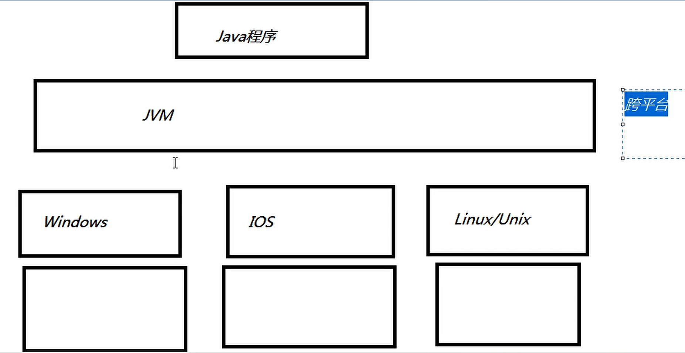

2、Java的特点（了解）
（1）面向对象：关注类、对象、接口等，以及继承、实现等关系
（2）强类型：关注数据类型
（3）体系中立的：字节码.class文件
（4）垃圾回收：GC

Java语言主要特征
?	Java语言是易学的。Java语言的语法与C语言和C++语言很接近，使得大多数程序员很容易学习和使用Java。
?	Java语言是强制面向对象的。Java语言提供类、接口和继承等原语，为了简单起见，只支持类之间的单继承，但支持接口之间的多继承，并支持类与接口之间的实现机制（关键字为implements）。
?	Java语言是分布式的。Java语言支持Internet应用的开发，在基本的Java应用编程接口中有一个网络应用编程接口（java net），它提供了用于网络应用编程的类库，包括URL、URLConnection、Socket、ServerSocket等。Java的RMI（远程方法激活）机制也是开发分布式应用的重要手段。
?	Java语言是健壮的。Java的强类型机制、异常处理、垃圾的自动收集等是Java程序健壮性的重要保证。对指针的丢弃是Java的明智选择。
?	Java语言是安全的。Java通常被用在网络环境中，为此，Java提供了一个安全机制以防恶意代码的攻击。如：安全防范机制（类ClassLoader），如分配不同的名字空间以防替代本地的同名类、字节代码检查。
?	Java语言是体系结构中立的。Java程序（后缀为java的文件）在Java平台上被编译为体系结构中立的字节码格式（后缀为class的文件），然后可以在实现这个Java平台的任何系统中运行。
?	Java语言是解释型的。如前所述，Java程序在Java平台上被编译为字节码格式，然后可以在实现这个Java平台的任何系统的解释器中运行。
?	Java是性能略高的。与那些解释型的高级脚本语言相比，Java的性能还是较优的。
?	Java语言是原生支持多线程的。在Java语言中，线程是一种特殊的对象，它必须由Thread类或其子（孙）类来创建

去了解底层源码、原理   

C语言指针    强大的工具  用得好

Java垃圾回收 

JVM虚拟机

安全性   强类型  数据类型  

Java是  工业级   

Python、Javascript  弱类型的

ClassLoader 类加载

体系中立的  .java 再  .class字节码  再 机器码

Android  Google

Java   Oracle

设计  虚拟机   字节码

体系中立

JVM虚拟机不仅仅Java   其他的语言JVM   符合标准就OK

解释性

字节码 不能被计算机识别     计算机只能 0、1

解释成机器指令   计算机识别

字节码  半成品样的

比那些解释型的高级脚本语言Java的性能还是较优的。

什么是异常处理 什么是垃圾回收  什么是面向对象

什么是类加载  什么是解释型   类、接口、继承

Java的特点 

面向对象  关注类、对象、接口  继承、实现

强类型 关注数据类型

体系中立的 字节码.class文件

垃圾回收   GC

