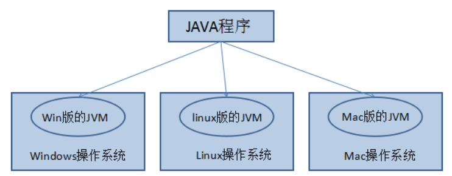
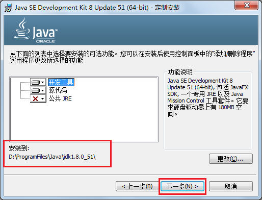

# Java概述

[TOC]


# 第一章 Java概述

## 1.1 Java历史

Java诞生于SUN（Stanford University Network），09年SUN被Oracle（甲骨文）收购。

Java之父是詹姆斯.高斯林(James Gosling)。

1996年发布JDK1.0版。

目前最新的版本是Java12。我们学习的Java8。

2020-03 Java14来了

## 1.2 Java语言最主要的特点

* 特点一：面向对象

两个基本概念：类、对象

三大特性：封装、继承、多态

类 对象 封装 继承 多态  

* 特点二：健壮性

吸收了C/C++语言的优点，但去掉了其影响程序健壮性的部分（如指针、内存的申请与释放等），提供了一个相对安全的内存管理和访问机制

指针 内存的申请与释放  垃圾收回 

* 特点三：跨平台性

跨平台性：通过Java语言编写的应用程序在不同的系统平台上都可以运行。“Write once , Run Anywhere”一次编写，处处运行。

原理：只要在需要运行 java 应用程序的操作系统上，先安装一个Java虚拟机 (JVM Java Virtual Machine) 即可。由JVM来负责Java程序在该系统中的运行。因为有了JVM，同一个Java 程序在三个不同的操作系统中都可以执行。这样就实现了Java 程序的跨平台性。



## 1.3 Java环境搭建

### 1.3.1 JDK、JRE、JVM

Java开发人员需要安装JDK。如果仅仅是运行Java程序，那么只需要按照JRE。

JDK（Java Development kits）：Java开发工具包。

JRE（Java Runtime Environment）：Java运行环境。

JVM（Java Virtual Machine）：Java虚拟机。

JDK = JRE + 开发工具（javac.exe,java.exe,javadoc.exe等）

JRE = JVM + 核心类库（常用类：String、日期时间、数学、集合、IO、网络、多线程等）


JRE = JVM + 核心类库  常用类 String 日期时间 数学  集合  IO 网络 多线程

JDK = JRE + 开发工具（javac.exe java.exe javadoc.exe）

### 1.3.2  Java环境搭建

1、安装JDK



安装到指定的目录  专门放开发环境的 工具的

目录不要有中文、空格     太高级了  歧义  有    这样这样的这样  

2、配置JDK的开发工具目录到path环境变量中

​	例如：D:\ProgramFiles\Java\jdk1.8.0_51\bin;

​	注意：这个安装目录以你自己的安装目录为准


JDK安装的根目录

bin 开发工具集  jre  JDK中包含jre

src源代码压缩包  

配置path   在任意路径可以找到

（1）为什么配置path？

​	希望在命令行使用javac.exe等工具时，任意目录下都可以找到这个工具所在的目录。

（2）如何配置环境变量？

​	【计算机】右键【属性】，选择【高级系统设置】，选择【高级】，选择【环境变量】，选择【系统环境变量】，编辑path，在【**path原有值**】的前面加入D:\ProgramFiles\Java\jdk1.8.0_51\bin;

## 1.4 第一个Java应用程序

```java
class HelloWorld{
    public static void main(String[] args){
        System.out.print("Hello Java!");
    }
}
```

### 1.4.1 Java程序的开发步骤

三步：

1、编辑/编写源代码

要求：源文件必须是.java文件

2、编译

目的：把源文件编译为.class字节码文件（因为JVM只认识字节码）

工具：javac.exe

格式：

```cmd
javac 源文件名.java
```


3、运行

工具：java.exe

格式：

```cmd
java 类名
java 字节码文件名
```

要求：可以被运行的类，必须包含main方法


### 1.4.2 Java程序的结构与格式

结构：

```java
类{
    方法{
        语句;
    }
}
```

格式：

（1）每一级缩进一个Tab键

（2）{}的左半部分在行尾，右半部分单独一行，与和它成对的"{"的行首对齐


### 1.4.3 Java程序的入口

Java程序的入口是main方法

```java
public static void main(String[] args){
    
}
```


### 1.4.4 Java注释

1、单行注释

```java
//注释内容
```

2、多行注释

```java
/*
注释内容
*/
```

3、文档注释

```java
/**
文档注释（后面注解部分讲解）
*/
```


## 1.5 编写Java程序时应该注意的问题

1、字符编码问题

当cmd命令行窗口的字符编码与.java源文件的字符编码不一致，如何解决？


解决方案一：

​	在Notepad++等编辑器中，修改源文件的字符编码


解决方案二：

​	在使用javac命令式，可以指定源文件的字符编码

```cmd
javac -encoding utf-8 Review01.java
```

javac -encoding utf-8 review01.java

2、大小写问题

（1）源文件名：

​	不区分大小写，我们建议大家还是区分

（2）字节码文件名与类名

​	区分大小写

（3）代码中

​	区分大小写

开发人员 与 普通人员

3、源文件名与类名一致问题？

（1）源文件名是否必须与类名一致？public呢？

如果这个类不是public，那么源文件名可以和类名不一致。

如果这个类是public，那么要求源文件名必须与类名一致。

我们建议大家，不管是否是public，都与源文件名保持一致，而且一个源文件尽量只写一个类，目的是为了好维护。


（2）一个源文件中是否可以有多个类？public呢？

一个源文件中可以有多个类，编译后会生成多个.class字节码文件。

但是一个源文件只能有一个public的类。


（3）main必须在public的类中吗？

不是。

但是后面写代码时，基本上main习惯上都在public类中。


# 第二章 Java的基础语法

## 2.1 标识符

简单的说，凡是程序员自己命名的部分都可以称为标识符。

即给类、变量、方法、包等命名的字符序列，称为标识符。


1、标识符的命名规则

（1）Java的标识符只能使用26个英文字母大小写，0-9的数字，下划线_，美元符号$

（2）不能使用Java的关键字（包含保留字）和特殊值

（3）数字不能开头

（4）不能包含空格

（5）严格区分大小写

大小写敏感

2、标识符的命名规范

（1）见名知意

（2）类名、接口名等：每个单词的首字母都大写，形式：XxxYyyZzz，

例如：HelloWorld，String，System等

（3）变量、方法名等：从第二个单词开始首字母大写，其余字母小写，形式：xxxYyyZzz，

例如：age,name,bookName,main

（4）包名等：每一个单词都小写，单词之间使用点.分割，形式：xxx.yyy.zzz，

例如：java.lang

（5）常量名等：每一个单词都大写，单词之间使用下划线_分割，形式：XXX_YYY_ZZZ，

例如：MAX_VALUE,PI

常量名 每一个单词都大写  单词之间使用下划线_分割   `AAA_BBB_CCC`


## 2.2 变量

### 2.2.1 变量的概念

变量的作用：用来存储数据，代表内存的一块存储区域，变量中的值是可以改变的。

### 2.2.2 变量的三要素

1、数据类型

2、变量名

3、值

变量的作用  用来存储数据 代表内存的一块存储区域  变量中的值是可以改变的

### 2.2.3 变量的使用应该注意什么？

1、先声明后使用

> 如果没有声明，会报“找不到符号”错误

2、在使用之前必须初始化

> 如果没有初始化，会报“未初始化”错误

3、变量有作用域

> 如果超过作用域，也会报“找不到符号”错误

4、在同一个作用域中不能重名


### 2.2.4 变量的声明和赋值、使用的语法格式？

1、变量的声明的语法格式：

```java
数据类型  变量名;
例如：
int age;
String name;
double weight;
char gender;
boolean isMarry;
```

2、变量的赋值的语法格式：

```java
变量名 = 值;
例如：
age = 18;
name = "柴林燕"; //字符串的值必须用""
weight = 44.4;
gender = '女';//单字符的值必须使用''
isMarry = true;
```

字符  char c = 'x';

字符串 String str = “xxx”;

3、变量的使用的语法格式：

```java
通过变量名直接引用

例如：
(1)输出变量的值
System.out.print(name);
System.out.print("姓名：" + name);//""中的内容会原样显示
System.out.print("name = " + name);
(2)计算
age = age + 1;
```

# 2.3 数据类型

### 2.3.1 Java数据类型的分类

1、基本数据类型

​	8种：整型系列（byte,short,int,long）、浮点型(float,double)、单字符型（char）、布尔型（boolean）

2、引用数据类型

​	类、接口、数组、枚举.....

### 2.3.2 Java的基本数据类型

1、整型系列

（1）byte：字节类型

占内存：1个字节

存储范围：-128~127

（2）short：短整型类型

占内存：2个字节

存储范围：-32768~32767

-32768~32767   2^15次方

（3）int：整型

占内存：4个字节

存储范围：-2的31次方 ~ 2的31次方-1

约21亿 

int 整型 默认的

（4）long：整型

占内存：8个字节

存储范围：-2的63次方 ~ 2的63次方-1

> 注意：如果要表示某个常量数字它是long类型，那么需要在数字后面加L

L

2、浮点型系列（小数）

（1）float：单精度浮点型

占内存：4个字节

精度：科学记数法的小数点后6~7位

> 注意：如果要表示某个常量数字是float类型，那么需要在数字后面加F或f

F或f    占内存4个字节   科学记数法的小数点后6-7位

（2）double：双精度浮点型

占内存：8个字节

精度：科学记数法的小数点后15~16位


3、单字符类型

char：字符类型

占内存：2个字节

Java中使用的字符集：Unicode编码集

字符的三种表示方式：

（1）'一个字符'

例如：'A'，'0'，'尚'

（2）转义字符

```
\n：换行
\r：回车
\t：Tab键
\\：\
\"：”
\'：
\b：删除键Backspace
```

\n

\r

\t

\b    Backspace  光标向左删除一位

`\"`

`\'`


（3）\u字符的Unicode编码值的十六进制型

例如：\u5c1a代表'尚'

0000

fffff

???

两个字节？

4、布尔类型

boolean：只能存储true或false

