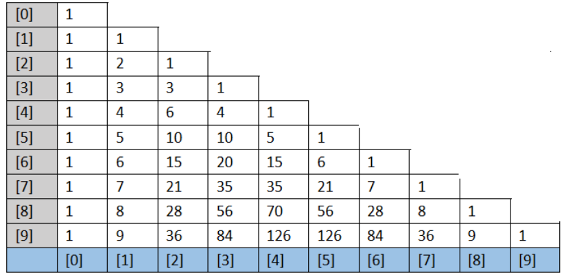

# day06课后练习

# 一维数组基础题目

## 第1题：

案例：从键盘输入本组学员的人数，和本组学员的成绩，用数组存储成绩，然后实现从高到低排序


## 第2题：

案例：从键盘输入本组学员的人数，和本组学员的姓名，用数组存储姓名，然后再从键盘输入一个姓名，查找它是否在之前的数组中，如果存在，就显示它的下标


## 第3题：

案例：从键盘输入一个英语单词，然后查找这个单词中是否存在'a'字母

提示：把字符串转成字符数组，可以使用String类型的toCharArray()方法

```java
String str = "hello";
char[] arr = str.toCharArray();//arr数组中就是{'h','e','l','l','o'}
```


## 第4题：

随机验证码。

* 随机生成十组六位字符组成的验证码。
* 验证码由大小写字母、数字字符组成。


开发提示：

* 使用字符数组保存原始字符，利用Random类生成随机索引。

# 二维数组基础题目

## 第5题：

* 使用二维数组打印一个 10 行杨辉三角.

  1

  1 1

  1 2 1

  1 3 3  1

  1 4 6  4  1

  1 5 10 10 5 1

   ....

* 开发提示

1. 第一行有 1 个元素, 第 n 行有 n 个元素

2. 每一行的第一个元素和最后一个元素都是 1

3. 从第三行开始, 对于非第一个元素和最后一个元素的元素. 

   ```
   yanghui[i][j] = yanghui[i-1][j-1] + yanghui[i-1][j];
   ```

   

## 第6题：

   * 打印扑克牌，效果如图所示：

     

   * 开发提示：

     * 使用一个两行的二维的字符串数组，分别保存花色和点数

## 第7题：

需求：保存全班的每个组的成绩，并对成绩做统计

1. 从键盘输入一共有几组
2. 从键盘输入每一组分别有多少人
3. 从键盘输入每一个同学的成绩
4. 统计每一组的最高分、最低分
5. 统计每一组的平均分
6. 统计全班的最高分、最低分
7. 统计全班的平均分
8. 统计全班的总人数