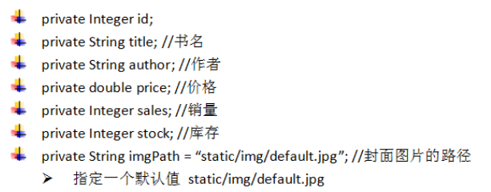

# day09_课后练习

## 第一题：概念辨析

1. 一个类与它的对象之间是什么关系？
2. 如何定义一个类，由哪些部分组成，各个部分的作用是什么？
3. 如何创建一个对象，如何使用该对象？
4. 局部变量和成员变量的区别？
5. 构造方法和成员方法的区别？

## 第二题：语法练习

* 语法与技能：
  * 包、类（属性、构造器、方法）、对象、this
  * eclipse使用
* 在com.atguigu.test02.bean包中定义一个圆形Circle类。
  * 属性：私有化
    * r：半径
  * 构造方法：
    * 无参构造方法
    * 满参构造方法
  * 成员方法：
    * get/set方法
    * showArea方法：打印圆形面积
    * showPerimeter方法：打印圆形周长
* 在com.atguigu.test02.test包中定义测试类TestCircle：创建Circle对象，并测试。

* 开发提示： 

  > 面向周长公式：2 * 3.14*  半径
  >
  > 圆形面积公式：3.14* 半径^2

## 第三题：语法练习

* 语法与技能：
  * 包、类（属性、构造器、方法）、对象、this
  * eclipse使用
* 在com.atguigu.test03.bean包中定义一个日期MyDate类。
  * 属性：
    * year：年
    * month：月
    * day：日
  * 构造方法：
    * 满参构造方法
  * 成员方法：
    * get/set方法
    * void showDate方法：打印日期。
    * boolean isLeapYear()方法：判断当前日期是否是闰年
* 在com.atguigu.test03.test包中定义测试类：创建MyDate对象，并测试。

* 代码实现，效果如图所示：

  

* 开发提示： 

  * 闰年：
    * 普通年（不能被100整除的年份）能被4整除的为闰年。（如2004年就是闰年,1999年不是闰年）；
    * 世纪年（能被100整除的年份）能被400整除的是闰年。(如2000年是闰年，1900年不是闰年)；

## 第四题：语法练习

* 语法与技能：
  * 包、类（属性、构造器、方法）、对象、this
  * eclipse使用
* 在com.atguigu.test04.bean包中定义一个扑克Card类。
  * 属性：
    * 花色
    * 点数
  * 构造方法：
    * 满参构造方法
  * 成员方法：
    * showCard方法：打印牌面信息
* 在com.atguigu.test04.test包中定义测试类，创建Card对象，调用showCard方法。

* 代码实现，效果如图所示：

  

## 第五题：语法练习

* 语法与技能：
  * 包、类（属性、构造器、方法）、对象、this
  * eclipse使用

* 在com.atguigu.test05.bean包中创建一个Book类，属性私有化，提供有参和无参构造，get/set

  

* 在com.atguigu.test05.test包中，创建TestBook类，并创建Book数组，创建多个Book对象，存储到数组中，并遍历显示他们的信息，并按照销量从高到低排序

  

## 第六题：语法练习

案例：

​	1、在com.atguigu.test06.bean包中声明员工类、程序员类、设计师类、架构师类

* 员工类属性：编号、姓名、年龄、手机号码

* 程序员类属性：编程语言

* 设计师类属性：奖金

* 架构师类属性：持有股票数量

​	要求：属性私有化，无参有参构造，get/set，getInfo方法（考虑重写）

2、在com.atguigu.test06.test包中声明测试类Test06

创建各种类的对象，并测试

