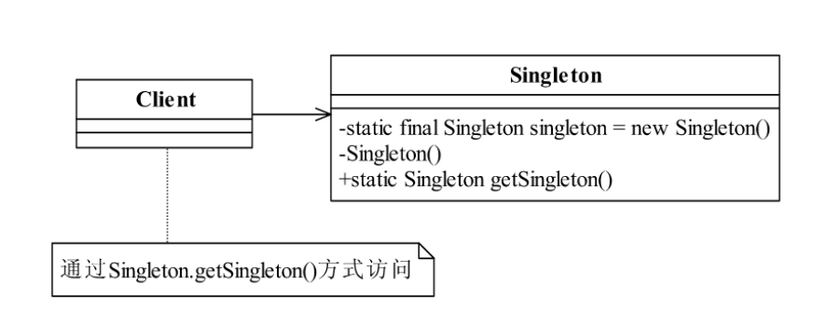

# Java单例设计模式

# 1、单例设计模式定义

单例设计模式（Singleton Pattern）

单例模式（Singleton Pattern）是一个比较简单的模式，它的定义是 Ensure a class has only one instance, and provide a global point of access to it.（确保某一个类只有一个实例，而且自行实例化并向整个系统提供这个实例。）

单例：某个类只能有唯一的一个实例对象。

使用单例模式时，有三个要点：

（1）某个类只能有一个实例；

（2）该类必须自行创建这个实例；

（3）该类必须自行向整个系统提供这个实例。


# 2、如何实现单例？

## 1、饿/恶汉式

饿/恶汉式

不管我们使用者是否需要这个对象，它都上来先给你创建好这个唯一的对象。

（1）枚举式  枚举类型

```java
public enum Single{
    INSTANCE
}
```


```java
enum SingleEnum {
    INSTANCE;//instance 实例
//	public static void test(){
//		//..
//	}
}
@Test
    public void test1() {
        SingleEnum s1 = SingleEnum.INSTANCE;
        SingleEnum s2 = SingleEnum.INSTANCE;
        System.out.println(s1 == s2);//true
    }

```

true 同一个对象

（2）形式二

①构造器私有化

②用一个全局的静态的常量，来保存这个唯一的实例对象

构造器私有化 用一个全局的静态的常量 来保存这个唯一的实例对象

```java
public class Single{
    public static final Single INSTANCE = new Single();
    private Single(){
        
    }
}
```


```java
class SingleClass {
    public static final SingleClass INSTANCE = new SingleClass();

    private SingleClass() {

    }
}

 @Test
    public void test3() {
        SingleClass s1 = SingleClass.INSTANCE;
        SingleClass s2 = SingleClass.INSTANCE;
        System.out.println(s1 == s2);//true 
    }

```


（3）形式三

①构造器私有化

②用一个私有的静态的常量，来保存这个唯一的实例对象

③提供一个静态方法，来返回这个常量对象

构造器私有化

用一个私有的静态的常量 来保存这个唯一的实例对象 

提供一个静态方法 来返回这个常量对象

```java
public class Single{
    private static final Single INSTANCE = new Single();
    private Single(){
        
    }
    public static Single getInstance(){
        return INSTANCE;
    }
}
```


```java
class Single {
    private static final Single INSTANCE = new Single();

    private Single() {

    }

    public static Single getInstance() {
        return INSTANCE;
    }
}

@Test
    public void test4() {
        Single s1 = Single.getInstance();
        Single s2 = Single.getInstance();
        System.out.println(s1 == s2);//true
    }

```


## 2、懒汉式

懒汉式

延迟创建对象。当使用者或者这个对象，要用到对象时，我再创建。

能不创建就不创建，不得不创建的时候在创建。 节省内存吧。

（2）形式一

见下面，考虑线程安全问题和性能问题

```java
public class Single{
    private static Single instance;
    private Single(){}
    
    public static Single getInstance(){
        if(instance == null){
            synchronized(Single.class){
                if(instance == null){
                    instance = new Single();
                }
            }
        }
        return instance;
    }
}
```


```java
class LazyClass {
    private static LazyClass instance;

    private LazyClass() {

    }

    public static LazyClass getInstance() {
//        return new LazyClass();//错误的
        if (instance == null) {//提高效率
            synchronized (LazyClass.class) {//当前类的Class对象
                if (instance == null) {//安全判断
                    try {
                        Thread.sleep(100);
                    } catch (InterruptedException e) {
                        e.printStackTrace();
                    }
                    instance = new LazyClass();
                }
            }
        }
        return instance;
    }

    //安全没问题，但是认为不是最优的
    //比如 我线程已经创建好了 后面可以直接拿呀
/*	public synchronized static LazyClass getInstance(){
		if(instance == null){
			try {
				Thread.sleep(100);
			} catch (InterruptedException e) {
				e.printStackTrace();
			}
			instance = new LazyClass();
		}
		return instance;
	}*/

    //有安全问题
/*	public static LazyClass getInstance(){
//		return new LazyClass();//错误的
		if(instance == null){
			try {
				Thread.sleep(100);
			} catch (InterruptedException e) {
				e.printStackTrace();
			}
			instance = new LazyClass();
		}
		return instance;
	}*/
}

LazyClass s1;
    LazyClass s2;

    @Test
    public void test6() {
        //匿名的内部类，继承Thread类
        Thread t1 = new Thread() {
            public void run() {
                s1 = LazyClass.getInstance();
            }
        };

        Thread t2 = new Thread() {
            public void run() {
                s2 = LazyClass.getInstance();
            }
        };

        t1.start();
        t2.start();

        try {
            //这里用join的目的是，为了两个子线程都执行完，再执行主线程的System.out.println(s1);
            t1.join();
            t2.join();
        } catch (InterruptedException e) {
            e.printStackTrace();
        }

       		System.out.println(s1);//com.awen.test17.LazyClass@4f2410ac
       System.out.println(s2);//com.awen.test17.LazyClass@4f2410ac
        
        System.out.println(s1 == s2);//true
    }

```


（1）形式二：内部类形式

```java
public class Single{
    private Single(){}
    
    private static class Inner{
        static final Single INSTANCE = new Single();
    }
    
    public static Single getInstance(){
        return Inner.INSTANCE;
    }
    
}
```


```java
class Lazy {
    private Lazy() {

    }

    private static class Inner {
        public static final Lazy INSTANCE = new Lazy();//在内部类中，创建外部类的唯一对象
    }

    public static Lazy getInstance() {
        return Inner.INSTANCE;
    }
}

 @Test
    public void test7(){
        Lazy lazy1 = Lazy.getInstance();
        Lazy lazy2 = Lazy.getInstance();
        System.out.println(lazy1 == lazy2);//true
    }

```

用到才会创建

# 3、单例模式的应用


## 1、单例模式的优点

单例模式的优点

由于单例模式只生成一个实例，在内存中只有一个实例，所以减少了系统的性能开销，减少了内存开支，特别是一个对象需要频繁地创建、销毁时，而且创建或销毁时性能又无法优化，单例模式的优势就非常明显。

## 2、单例模式的缺点

单例模式一般没有接口，扩展很困难，若要扩展，除了修改代码基本上没有第二种途径可以实现。

单例模式为什么不能增加接口呢？因为接口对单例模式是没有任何意义的，它要求“自行实例化”，并且提供单一实例，而接口或抽象类是不可能被实例化的。

单例模式要求一个类只能生成一个对象，所有对象对它的依赖都是相同的，因为只有一个对象，整个系统中，某个类型的对象只有一个。


## 3、最佳实践

单例模式是23个模式中比较简单的模式，应用也非常广泛，比如在Spring中，每个Bean默认就是单例的，这样做的优点是Spring容器可以管理这些Bean的生命期，决定什么时候创建出来，什么时候销毁，销毁的时候要如何处理，等等。如果采用非单例模式（Prototype类型），则Bean初始化后的管理交由J2EE容器，Spring容器不再跟踪管理Bean的生命周期。  原型prototype 

## 4、单例模式

单例模式的通用类

Singleton类称为单例类，通过使用private的构造函数确保了在一个应用中只产生一个实例，并且是自行实例化的（在Singleton中自己使用new Singleton()）。




通过定义一个私有访问权限的构造函数，避免被其他类new出来一个对象，而该类自己则可以new一个对象出来，其他类对该类的访问都可以通过getInstance获得同一个对象。

单例：某个类只能有唯一的一个实例对象 ，只能有唯一的一个实例对象。

单例模式通用代码

```java
public class Singleton {
    private static final Singleton singleton = new Singleton();

    //限制产生多个对象
    private Singleton() {

    }

    //通过该方法获得实例对象
    public static Singleton getSingleton() {
        return singleton;
    }

    //类中其他方法，尽量是static
    public static void doSomething() {
         
    }
}
```


# 4、小结

单例模式

确保某一个类只有一个实例，而且自行实例化并向整个系统提供这个实例。

使用场合当在系统中某个特定的类对象实例只需要有一个的时候，可以使用单例设计模式。需要注意的是，只有真正有“单一实例”的需求时才可使用。

单例模式是23个模式中比较简单的模式，应用也非常广泛，比如在Spring中，每个Bean默认就是单例的，这样做的优点是Spring容器可以管理这些Bean的生命期，决定什么时候创建出来，什么时候销毁，销毁的时候要如何处理，等等。如果采用非单例模式（Prototype类型），则Bean初始化后的管理交由J2EE容器，Spring容器不再跟踪管理Bean的生命周期  原型prototype 。