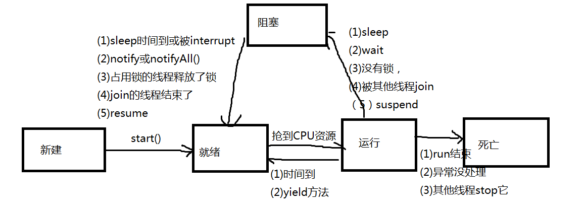

# 多线程

## 1、 多线程相关的概念

1、程序（Program）

​	为了实现一个功能，完成一个任务而选择一种编程语言编写的一组指令的集合。

软件 = 程序 + 程序运行所需要的一些资源文件。 一个软件中可能会有很多个程序构成。

2、进程（Process）

​	程序的一次运行。操作系统会给这个进程分配资源（例如：内存）。

进程是操作系统分配资源的最小单位，进程与进程之间的内存是独立，无法直接共享。最早的DOS操作系统是单任务的，同一时间只能运行一个进程。后来现在的操作系统都是支持多任务的，可以同时运行多个进程。两个进程之间进行来回切换，通信（交换数据）等操作时，成本比较高。

3、线程（Thread）

​	线程是进程中的其中一条执行路径。一个进程中至少有一个线程，也可以有多个线程。有的时候也把线程称为轻量级的进程。同一个进程的多个线程之间有些内存是可以共享的（方法区、堆），也有些内存是独立的（栈（包括虚拟机栈和本地方法栈）、程序计数器）。 因为线程之间可能使用共享内存，那么在数据交换成本上就比较低。而且线程之间的切换相对进程对于CPU和操作系统来说，成本比较低。

一个进程中至少有一个线程。

4、并行： 多个处理器同时可以执行多条执行路径。

要求同时进行。针对CPU多核，甚至多个CPU，同时运行多个线程任务。

有同时处理多个任务的能力，并行。

5、并发：多个任务同时执行，但是可能存在先后关系。

有处理多个任务的能力，不一定要同时。

如果某个系统支持两个或者多个动作（Action）**同时存在**，那么这个系统就是一个**并发系统**。如果某个系统支持两个或者多个动作**同时执行**，那么这个系统就是一个**并行系统**。并发系统与并行系统这两个定义之间的关键差异在于**“存在”**这个词。

在并发程序中可以同时拥有两个或者多个线程。这意味着，如果程序在单核处理器上运行，那么这两个线程将交替地换入或者换出内存。这些线程是同时“存在”的——每个线程都处于执行过程中的某个状态。如果程序能够并行执行，那么就一定是运行在多核处理器上。此时，程序中的每个线程都将分配到一个独立的处理器核上，因此可以同时运行。《并发的艺术》 — 〔美〕布雷谢斯

看能不能同时被（多个）cpu执行，如果可以就说明是并行，而并发是多个线程被（一个）cpu 轮流切换着执行。

并发（Concurrency）是同时处理很多事情（dealing with lots of things at once），并行（Parallelism）是同时执行很多事情（doing lots of things at once）；并行是并发的子集。


CPU：一个CPU同一个时间只能够运行一个线程的任务。

如何实现多个线程同时运行的呢？

是因为CPU是非常快，这个速度远远高于内存、硬盘、人的大脑反应的速度。

那么CPU会在多个线程之间，快速的切换，人是感觉不到。


楼上说的挺清楚的了，相信答主知道并发并行区别了。但是好像没人回答答主第二个问题（答主关心的也是这个问题，估计也知道并发并行的区别）。
问题：多线程在多核上是并发还是并行？我的理解：对于单核，多线程的多任务是在单cpu交替执行，属于并发；对于多核，多线程的任务如果能够分布在各个cpu
上（线程数少许核心数），那么就是并行。
这是之前看书自己的理解，仅供参考，如果不对的麻烦告知一下。

我的理解，无多核，不并行。并发则有多进程，多线程，io多路复用等模型。


## 2、两种实现多线程的方式

Java中如何去实现多线程？

（1）Java的程序入口是main，其实也是main线程，主线程。

线程是进程的其中一条执行路径，即一个进程至少有一个线程。那么main线程就是Java程序进程的第一个线程了。

（2）如何开启main线程以外的其他线程呢？

这里写2种，还有其他方式的。

1、继承Thread类

 步骤：

（1）编写线程类，去继承Thread类（java.lang.Thread）

（2）重写public void run(){}

在run()中需要编写这个线程需要完成的任务。

（3）创建线程对象

（4）启动线程：start()，是调用start()方法。

```java
class MyThread extends Thread {
     @Override
    public void run(){
        //...
    }
}
class Test{
    public static void main(String[] args){
        MyThread my = new MyThread();
        my.start();//有名字的线程对象启动
        
        new MyThread().start();//匿名线程对象启动
        
        //匿名内部类的匿名对象启动
        new Thread(){
            public void run(){
                //...
            }
        }.start();
        
        //匿名内部类，但是通过父类的变量多态引用，启动线程
        Thread t =  new Thread(){
            public void run(){
                //...
            }
        };
        t.start();
    }
}
```


```java
public class TestThread2 {
    public static void main(String[] args) {
        System.out.println("hello thread");

        MyThread my = new MyThread();
        //顺序执行 如果my.run()没my.start() 就是顺序执行了
//		my.run();//这么调用，就不是开启多线程，而是普通对象调用方法
        my.start();//从父类Thread中继承的

        //打印main方法的
        for (int i = 1; i <=100; i++) {
            System.out.println("main:" + i);
        }
    }

}
class MyThread extends Thread{

    @Override
    public void run() {
        //例如：这个线程要完成的任务是，打印1-100之间的数字
        for (int i = 1; i <= 100; i++) {
            System.out.println("自定义线程：" + i);
        }
    }

}
```

可能 你执行一下 我执行一下

2、实现Runnable接口

步骤：

（1）编写线程类，实现Runnable接口

（2）重写public void run(){}

（3）创建线程对象

（4）借助Thread类的对象启动线程

```java
class MyRunnable implements Runnable{
    public void run(){
        //...
    }
}
class Test {
    public static void main(String[] args){
        MyRunnable my = new MyRunnable();
        Thread t1 = new Thread(my);
        Thread t2 = new Thread(my);
        t1.start();
        t2.start();
        
        //两个匿名对象
        new Thread(new MyRunnable()).start();
        
        //匿名内部类的匿名对象作为实参直接传给Thread的构造器
        new Thread(new Runnable(){
            public void run(){
                //...
            }
        }).start();
            
    }
}
```


```java
public class TestRunnable {
    public static void main(String[] args) {
        MyRunnable my = new MyRunnable();
//		my.start();
        //借人家的
        Thread t = new Thread(my);
        t.start();

        for (int i = 1; i <=100; i++) {
            System.out.println("main:" + i);
        }
    }
}

class MyRunnable implements Runnable {
    // abstract Runnable
    // public abstract void run();
    @Override
    public void run() {
        // 例如：这个线程要完成的任务是，打印1-100之间的数字
        for (int i = 1; i <= 100; i++) {
            System.out.println("自定义线程：" + i);
        }
    }

}
```


## 3、 线程的生命周期

线程的生命周期：

（1）新建/出生

new好了一个线程对象，此时它和普通的Java对象并没有区别。

新建线程 new一个线程对象

（2）就绪

就绪状态的线程是具备被CPU调用的能力和状态，也只有这个状态的线程才能被CPU调用。即线程调用了start()。

就绪状态的线程是具备被CPU调用的能力和状态 

（3）运行

运行状态就是当前线程正在被CPU调度执行。

运行 当前线程被CPU调度执行中

运行->就绪  ①时间到②yield() 

（4）阻塞

从运行状态到阻塞状态有几种情况：

①sleep()

②wait()

③join()

④没锁

⑤suspend()已过时

从阻塞回到就绪状态

①sleep()时间到，sleep()被打断interrupt()

②notify()

③加塞的线程结束

④占用锁的线程释放锁

⑤resume()已过时

（5）死亡

从运行到死亡：①run()正常结束②run()遇到异常但是没处理③其他线程把你stop()（已过时）



## 4、 Thread的相关API

1、构造器

* Thread()
* Thread(String name)
* Thread(Runnable target)
* Thread(Runnable target, String name)

2、其他方法

（1）public void run()  子类必须重写，它的方法体也称为线程体，即线程的任务代码

（2）public void start() 线程启动必须用它

（3）获取当前线程对象：Thread.currentThread()

（4）获取当前线程的名称：getName()  public String getName()：线程的名称

主线程的名称：main

 * 		其他线程：默认是Thread-编号

（5）设置或获取线程的优先级：set/getPriority()

优先级的范围：[1,10]，Thread类中有三个常量：MAX_PRIORITY(10)，MIN_PRIORITY(1)，普通优先级 NORM_PRIORITY(5)

优先级高：被CPU调度的概率增加，不表示低的没有机会。

所以：不能依赖于优先级来解决先后的任务问题。

优先级只是影响概率。

（6）线程休眠：Thread.sleep(毫秒)  public static void sleep(毫秒)：休眠

（7）打断线程：interrupt()  中断线程  public void interrupt()

（8）暂停当前线程：Thread.yield()

public static void yield() ：暂停当前线程，让出本次的CPU资源，加入下一次CPU的抢夺中

（9）线程要加塞：join()             public void join()：加塞

> xx.join()这句代码写在哪个线程体中，哪个线程被加塞，和其他线程无关。

（10）判断线程是否已启动但未终止：isAlive()


```java
public class TestMethod {
    @Test
    public void testJoin() {
        MyRunnable my = new MyRunnable();
        Thread t = new Thread(my);
        t.start();

        MyRunnable my2 = new MyRunnable();
        Thread t2 = new Thread(my2);
        t2.start();


        for (int i = 1; i <= 10; i++) {
            System.out.println("main:" + i);
            if(i==3){
                try {
                    t.join();//当main线程打印到3后，被t线程加塞，main线程就不能继续，main被阻塞了，main要等到t线程结束才能继续了
                } catch (InterruptedException e) {
                    e.printStackTrace();
                }
//				Thread.yield();
            }
        }
    }

    @Test
    public void testInterrupt(){
        MyThread my1= new MyThread();
        my1.start();

        //主线程休眠3秒后，中断MyThread线程
        try {
            Thread.sleep(3000);
        } catch (InterruptedException e) {
            e.printStackTrace();
        }
        my1.interrupt();
    }

    @Test
    public void testPriority(){
        Thread t = Thread.currentThread();
        System.out.println(t.getPriority());//5

        MyThread my1= new MyThread();
        System.out.println(my1.getPriority());//5

        System.out.println("最高优先级：" + Thread.MAX_PRIORITY);//最高优先级：10
        System.out.println("最低优先级：" +Thread.MIN_PRIORITY);//最低优先级：1
        System.out.println("普通优先级：" + Thread.NORM_PRIORITY);//通优先级：5
    }

    @Test
    public void testName2(){
        Thread t = Thread.currentThread();
        System.out.println(t.getName());//main

        MyThread my1= new MyThread();
        System.out.println(my1.getName());//Thread-0

        MyThread my2 = new MyThread();
        System.out.println(my2.getName());//Thread-1

        MyThread my3 = new MyThread("线程3");
        System.out.println(my3.getName());
    }

    @Test
    public void testName(){
        Thread t = Thread.currentThread();
        System.out.println(t.getName());
    }

    @Test
    public void testSleep2(){
        //获取明天的当前时间
        try {
            Thread.sleep(24*60*60*1000);
        } catch (InterruptedException e) {
            e.printStackTrace();
        }
        System.out.println(System.currentTimeMillis());
    }

    @Test
    public void testSleep(){
        for (int i = 10; i>=1; i--) {
            System.out.println(i);
            try {
                Thread.sleep(1000);//毫秒   1000毫秒= 1秒
            } catch (InterruptedException e) {
                e.printStackTrace();
            }
        }
    }
}
class MyThread extends Thread{

    public MyThread() {
        super();
    }

    public MyThread(String name) {
        super(name);
    }

    public void run(){
        System.out.println("自定义线程");
        try {
            Thread.sleep(10000);//休眠10秒
        } catch (InterruptedException e) {
            System.out.println("自定义线程被打断");
            e.printStackTrace();
        }
        System.out.println("自定义线程休眠结束");
    }
}

class MyRunnable implements Runnable{
    public void run(){
        for (int i = 10; i>=1; i--) {
            System.out.println(Thread.currentThread().getName() + "run:" + i);
            try {
                Thread.sleep(1000);
            } catch (InterruptedException e) {
                e.printStackTrace();
            }
        }
    }
}
```


## 5、 关键字：volatile

volatile：易变，不稳定，不一定什么时候会变

修饰：成员变量

作用：当多个线程同时去访问的某个成员变量时，而且是频繁的访问，再多次访问时，发现它的值没有修改，Java执行引擎就会对这个成员变量的值进行缓存。一旦缓存之后，这个时候如果有一个线程把这个成员变量的值修改了，Jav执行引擎还是从缓存中读取，导致这个值不是最新的。如果不希望Java执行引擎把这个成员变的值缓存起来，那么就可以在成员变量的前面加volatile，每次用到这个成员变量时，都是从主存中读取。

## 10.6  关键字：synchronized（同步）

1、什么情况下会发生线程安全问题？

（1）多个线程

（2）共享数据

（3）多个线程的线程体中，多条语句再操作这个共享数据时

2、如何解决线程安全问题？同步锁

形式一：同步代码块

形式二：同步方法


3、同步代码块

```java
synchronized(锁对象){
    //一次任务代码，这其中的代码，在执行过程中，不希望其他线程插一脚
}
```

锁对象：

（1）任意类型的对象

（2）确保使用共享数据的这几个线程，使用同一个锁对象

4、同步方法

```java
synchronized 【修饰符】 返回值类型  方法名(【形参列表】)throws 异常列表{
    //同一时间，只能有一个线程能进来运行
}
```

锁对象：

（1）非静态方法：this（谨慎）

（2）静态方法：当前类的Class对象

## 10.7 线程通信

1、为了解决“生产者与消费者问题”。

当一些线程负责往“数据缓冲区”放数据，另一个线程负责从“数据缓冲区”取数据。

问题1：生产者线程与消费者线程使用同一个数据缓冲区，就是共享数据，那么要考虑同步

问题2：当数据缓冲区满的时候，生产者线程需要wait()， 当消费者消费了数据后，需要notify或notifyAll

​		当数据缓冲区空的时候，消费者线程需要wait()， 当生产者生产了数据后，需要notify或notifyAll

2、java.lang.Object类中声明了：

（1）wait()：必须由“同步锁”对象调用

（2）notfiy()和notifyAll()：必须由“同步锁”对象调用


3、面试题：sleep()和wait的区别

（1）sleep()不释放锁，wait()释放锁

（2）sleep()在Thread类中声明的，wait()在Object类中声明

（3）sleep()是静态方法，是Thread.sleep()

​        wait()是非静态方法，必须由“同步锁”对象调用

（4）sleep()方法导致当前线程进入阻塞状态后，当时间到或interrupt()醒来

​	 wait()方法导致当前线程进入阻塞状态后，由notify或notifyAll()


4、哪些操作会释放锁？

（1）同步代码块或同步方法正常执行完一次自动释放锁

（2）同步代码块或同步方法遇到return等提前结束

（3）wait()


5、不释放锁

（1）sleep()

（2）yield()

（3）suspend()