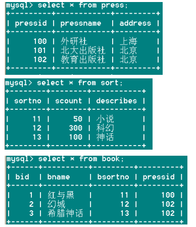
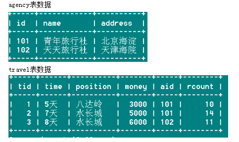

# day03_mysql_课后练习

# mysql练习题

## 第1题

案例：

1、创建一个数据库：day03_test01_school

2、创建如下表格

表1  Department表的定义

| **字段名** | **字段描述** | **数据类型** | **主键** | **外键** | **非空** | **唯一** |
| ---------- | ------------ | ------------ | -------- | -------- | -------- | -------- |
| DepNo      | 部门号       | int(10)      | 是       | 否       | 是       | 是       |
| DepName    | 部门名称     | varchar(20)  | 否       | 否       | 是       | 否       |
| DepNote    | 部门备注     | Varchar(50)  | 否       | 否       | 否       | 否       |

表2  Teacher表的定义

| **字段名** | **字段描述** | **数据类型** | **主键** | **外键** | **非空** | **唯一** |
| ---------- | ------------ | ------------ | -------- | -------- | -------- | -------- |
| Number     | 教工号       | int          | 是       | 否       | 是       | 是       |
| Name       | 姓名         | varchar(30)  | 否       | 否       | 是       | 否       |
| Sex        | 性别         | varchar(4)   | 否       | 否       | 否       | 否       |
| Birth      | 出生日期     | date         | 否       | 否       | 否       | 否       |
| DepNo      | 部门号       | int          | 否       | 是       | 否       | 否       |
| Salary     | 工资         | float        | 否       | 否       | 否       | 否       |
| Address    | 家庭住址     | varchar(100) | 否       | 否       | 否       | 否       |

3、添加记录

| **DepNo** | **DepName** | **DepNote**        |
| --------- | ----------- | ------------------ |
| 601       | 软件技术系  | 软件技术等专业     |
| 602       | 网络技术系  | 多媒体技术等专业   |
| 603       | 艺术设计系  | 广告艺术设计等专业 |
| 604       | 管理工程系  | 连锁经营管理等专业 |

| **Number** | **Name** | **Sex** | **Birth**  | **DepNo** | **Salary** | **Address**  |
| ---------- | -------- | ------- | ---------- | --------- | ---------- | ------------ |
| 2001       | Tom      | 女      | 1970-01-10 | 602       | 4500       | 四川省绵阳市 |
| 2002       | Lucy     | 男      | 1983-12-18 | 601       | 2500       | 北京市昌平区 |
| 2003       | Mike     | 男      | 1990-06-01 | 604       | 1500       | 重庆市渝中区 |
| 2004       | James    | 女      | 1980-10-20 | 602       | 3500       | 四川省成都市 |
| 2005       | Jack     | 男      | 1975-05-30 | 603       | 1200       | 重庆市南岸区 |

4、用SELECT语句查询Teacher表的所有记录。

5、找出所有其家庭地址中含有“北京”的教师的教工号及部门名称，要求显示结果中各列标题用中文别名表示。

6、获得Teacher表中工资最高的教工号和姓名。

7、找出所有收入在2500～4000之间的教工号。

8、查找在网络技术系工作的教师的姓名、性别和工资。

## 第2题

案例：

1、建立数据库day03_test02_student

2、建立以下三张表，并插入记录

Table:Classes

| **专业**   | **班级** | **姓名** | **姓别** | **座位** |
| ---------- | -------- | -------- | -------- | -------- |
| 计算机网络 | 1班      | 张三     | 男       | 8        |
| 软件工程   | 2班      | 李四     | 男       | 12       |
| 计算机维护 | 1班      | 王五     | 男       | 9        |
| 计算机网络 | 2班      | LILY     | 女       | 15       |
| 软件工程   | 1班      | 小强     | 男       | 20       |
| 计算机维护 | 1班      | CoCo     | 女       | 18       |

 Table:Score

| **姓名** | **英语** | **数学** | **语文** |
| -------- | -------- | -------- | -------- |
| 张三     | 65       | 75       | 98       |
| 李四     | 87       | 45       | 86       |
| 王五     | 98       | 85       | 65       |
| LILY     | 75       | 86       | 87       |
| 小强     | 85       | 60       | 58       |
| CoCo     | 96       | 87       | 70       |

  Table: Records

| **姓名** | **记录** |
| -------- | -------- |
| 小强     | 迟到     |
| 小强     | 事假     |
| 李四     | 旷课     |
| 李四     | 旷课     |
| 李四     | 迟到     |
| CoCo     | 病假     |
| LILY     | 事假     |

要求3：写出将张三的语文成绩修改为88的SQL语句。

要求4：搜索出计算机维护1班各门课程的平均成绩。

要求5：搜索科目有不及格的人的名单。

要求6：查询记录2次以上的学生的姓名和各科成绩。

## 第3题

案例：

1、建立数据库：day03_test03_xuankedb

2、建立如下三张表：

学生表Student由学号(Sno)、姓名(Sname)、性别(Ssex)、年龄(Sage)、所在系(Sdept)五个字段，Sno 为关键字。

课程表Course由课程号(Cno)、课程名(Cname)、选修课号(Cpno)、学分(Ccredit)四个字段，Cno为关键字。 

成绩表SG由学号(Sno)、课程号(Cno)、成绩(Grade)三个字段，(SNO, CNO)为关键字。

3、向Student表增加“入学时间(Scome)”列，其数据类型为日期型。

4、查询选修了3号课程的学生的学号及其成绩，查询结果按分数的降序排列。

5、查询学习1号课程的学生最高分数、平均成绩。

6、查询与“李洋”在同一个系学习的学生。

7、将计算机系全体学生的成绩置零。

8、删除学生表中学号为05019的学生记录。

9、删除计算机系所有学生的成绩记录。

## 第4题

案例：

1、建立数据库：day03_test04_library

2、建立如下三个表：
表一：press 出版社 
属性：编号pressid(int)、名称pressname(varchar)、地址address(varchar)

表二：sort 种类 
属性：编号sortno(int)、数量scount(int) 

表二：book图书
属性：编号bid(int)、名称 bname(varchar)、种类bsortno(int)、出版社编号pressid(int)

3、给sort表中添加一列属性：描述describes(varchar)

4、向三个表中各插入几条数据

5、查询出版社id为100的书的全部信息

6、查询出版社为外研社的书的全部信息

7、查询图书数量（scount）大于100的种类

8、查询图书种类最多的出版社信息

## 第5题

案例：

1、建立数据库：day03_test05_tour

2、建立如下两个表：

agency旅行社表： 

| 列名（英文名） | 列名（中文名） | 数据类型 | 允许空值 | 说明 |
| -------------- | -------------- | -------- | -------- | ---- |
| Id             | 旅行社编号     | int      | no       | 主键 |
| Name           | 旅行社名       | varchar  | no       |      |
| Address        | 旅行社地址     | varchar  | no       |      |
| Areaid         | 所属区域Id     | Int      | yes      |      |

 travel旅行线路表：

| 列名（英文名） | 列名（中文名） | 数据类型 | 允许空值 | 说明 |
| -------------- | -------------- | -------- | -------- | ---- |
| Tid            | 旅行线路编号   | int      | no       | 主键 |
| Time           | 所需时间       | varchar  | no       |      |
| Position       | 目的地         | varchar  | no       |      |
| Money          | 花费           | Float    | yes      |      |
| Aid            | 所属旅行社id   | Int      | no       | 外键 |
| Count          | 报名人数       | Int      | yes      |      |

3、添加记录

4、查出旅行线路最多的旅社

5、查出最热门的旅行线路(也就是查询出报名人数最多的线路)

6、查询花费少于5000的旅行线路

7、找到一次旅行花费最昂贵的旅行社名

8、查出青年旅社所有的旅行线路都玩一遍需要多少时间。