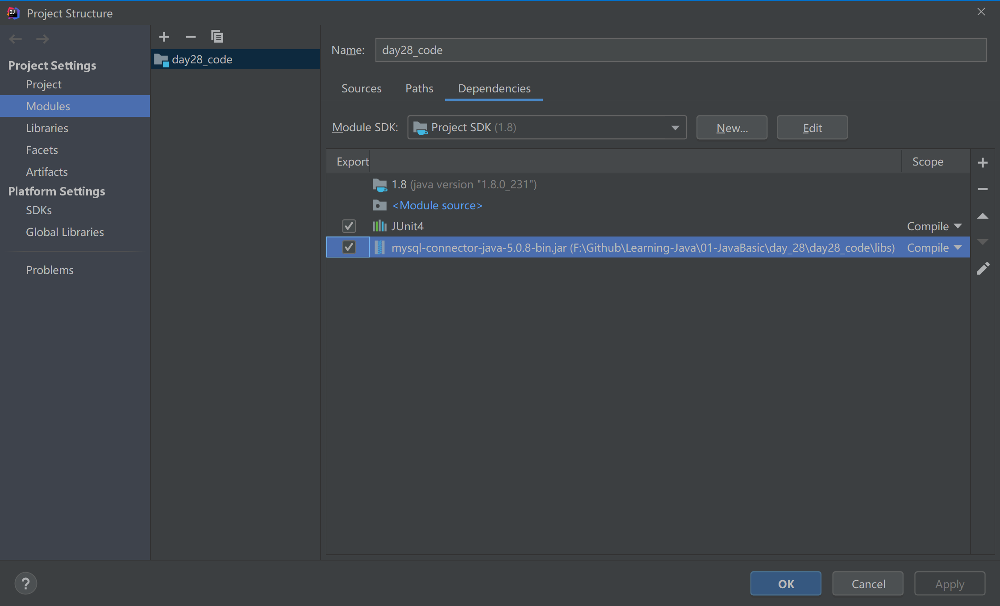

# JDBC概述

# 1、JDBC概述

JDBC：Java Database Connectivity   Java数据库连接 

JDBC API

它是代表一组独立于任何数据库管理系统（DBMS）的API，声明在java.sql与javax.sql包中，是SUN(现在Oracle)提供的一组接口规范。由各个数据库厂商来提供实现类，这些实现类的集合构成了数据库驱动jar。

JDBC通常指的是SUN为各大数据库厂商Java程序如何连接和操作它这个DBMS软件指定的统一的标准，即公共接口。这个公共接口由各大数据库厂商提供实现类，这些实现类就构成了数据库驱动。

Java程序员编写Java代码时，只要**面向接口编程**就可以了，运行时把驱动实现类加到项目中即可，Java程序员只要学习SUN公司提供的JDBC的公共接口就可以了。

如果SUN公司没有进行标准的统一接口， 就会导致每一种DBMS的API是不同，这对于Java程序员来说就是灾难，不同的DBMS不同的API，需要学习很多套的API。


小结

* JDBC Java Database Connectivity
* 声明在java.sql与javax.sql包中

* JDBC是代表一组公共的接口
* JDBC中的这些公共接口和DBMS数据库厂商提供的实现类（驱动jar），是为了实现Java代码可以连接DBMS，并且操作它里面的数据而声明的。
* Java能够连接DBMS  操作它里面的数据

根据API编写的程序都可以与驱动管理器进行通信，而驱动管理器则通过驱动程序与实际的数据库进行通信。


Java Application 

调用 JDBC

JDBC驱动（JDBCMysqlImpl、JDBCOracleImpl、JDBCSQLServerImpl等等）

调用MySQL、Oracle、SQLServer等等

可视化表示（位于客户端）从业务逻辑（位于中间层）和原始数据（位于数据库）中分离出来


常用的接口：

 * Connection：连接
 * Statement和PreparedStatement：增删改查
 * ResultSet：接收和处理查询结果

辅助的类：

 * DriverManager：驱动管理类。
 

# 2、JDBC使用步骤

使用步骤：

1、注册驱动

三部曲：

（1）将DBMS数据库管理软件的驱动jar拷贝到项目的libs目录中

例如：mysql-connector-java-5.1.36-bin.jar

（2）把驱动jar添加到项目的build path中

eclipse 在jar包上选择右键，Build Path-->Add to Build Path

IDEA:File -> Project Structure -> Modules -> 选中要添加build path的项目 -> Dependencies -> 点击右边的小加号 -> 选择JARs or directories ->选择要添加的外部jar包。



（3）将驱动类加载到内存中

Class.forName("com.mysql.jdbc.Driver");

2、获取Connection连接对象

Connection conn = DriverManager.getConnection(url,username,password);

mysql的url：jdbc:mysql://localhost:3306/数据库名?参数名=参数值

3、执行sql并处理结果

（1）编写sql

（2）创建Statement或PreparedStatement对象

（3）执行sql

增删改：调用executeUpate方法

查询：调用executeQuery方法

（4）处理结果

增删改：返回的是整数值

查询：返回ResultSet结果，需要使用next()和getXxx()结合进行遍历

4、释放连接等


相关的API：

1、DriverManager：驱动管理类

2、Connection：代表数据库连接

3、Statement和PreparedStatement：用来执行sql

​	执行增、删、改：int executeUpate()

​	执行查询：ResultSet executeQuery()

4、如何遍历ResultSet ？

​	（1）boolean next()：判断是否还有下一行

​	（2）getString(字段名或序号),getInt(字段名或序号),getObject(字段名或序号)

## 示例代码1：增、删、改

executeUpdate

```java
public class TestJDBC {
	public static void main(String[] args) throws ClassNotFoundException, SQLException {
		//1、注册驱动
		//(1)方式一：Class.forName("驱动类的全名称")
		Class.forName("com.mysql.jdbc.Driver");
//		(2)创建驱动类的对象
//		new com.mysql.jdbc.Driver();//硬编码
		//(3)通过DriverManager注册驱动
//		DriverManager.registerDriver(new com.mysql.jdbc.Driver());//硬编码
		
		//2、获取连接，连接数据库
        //TCP/IP协议编程，需要服务器的IP地址和端口号
		//mysql的url格式：jdbc协议:子协议://主机名:端口号/要连接的数据库名
		String url = "jdbc:mysql://localhost:3306/test";//其中test是数据库名
		String user = "root";
		String password = "123456";
		Connection conn = DriverManager.getConnection(url, user, password);
	
		//3、执行sql
		//添加一个部门到数据库的t_department表中
		//(1)编写sql
		String sql = "insert into t_department values(null,'计算部2','计算钞票2')";
		/*
		 * 回忆：	TCP/IP程序时
		 * Socket代表连接
		 * socket.getOutputStream()来发送数据，
		 * socket.getInputStream()来接收数据
		 * 
		 * 可以把Connection比喻成Socket
		 *    把Statement比喻成OutputStream
		 */
		//(2)获取Statement对象
		Statement st = conn.createStatement();
		//(3)执行sql
		int len = st.executeUpdate(sql);
		//(4)处理结果
		System.out.println(len>0?"成功":"失败");
		
		//4、关闭
		st.close();
		conn.close();
        
	}
}
```

Result

class com.mysql.jdbc.Connection
成功


## 示例代码2：查询

executeQuery

```java
public class TestSelect {
	public static void main(String[] args) throws Exception{
		// 1、注册驱动
		Class.forName("com.mysql.jdbc.Driver");

		// 2、连接数据库
		Connection conn = DriverManager.getConnection("jdbc:mysql://localhost:3306/test", "root", "123456");

		// 3、执行sql
		String sql = "SELECT * FROM t_department";
		Statement st = conn.createStatement();
		
		ResultSet rs = st.executeQuery(sql);//ResultSet看成InputStream
		while(rs.next()){//next()表示是否还有下一行
			Object did = rs.getObject(1);//获取第n列的值
			Object dname = rs.getObject(2);
			Object desc = rs.getObject(3);
			/*
			int did = rs.getInt("did");//也可以根据列名称，并且可以按照数据类型获取
			String dname = rs.getString("dname");
			String desc = rs.getString("description");
			 */
			
			System.out.println(did +"\t" + dname + "\t"+ desc);
		}

		// 4、关闭
		rs.close();
		st.close();
		conn.close();
	}
}
```


```java
import java.sql.Connection;
import java.sql.DriverManager;
import java.sql.ResultSet;
import java.sql.Statement;

import org.junit.Test;

/*
 * 步骤：
 * 1、注册驱动
 * 三部曲：（1）把jar复制到libs（2）把jar添加到Build path中（3）加载驱动类
 * 2、建立连接
 * 	获取Connection对象
 * 
 * 3、执行sql
 * (1)编写sql
 * (2)创建Statement
 * (3)执行sql
 * 
 * 增删改：int len = Statement对象.executeUpdate(sql)
 * 查询：ResultSet rs = Statement对象.executeQuery(sql)
 * 
 * 4、遍历结果集
 * 
 * 5、关闭资源
 */
public class TestJDBC2 {
	@Test
	public void test5()throws Exception{
		//1、加载驱动类
		Class.forName("com.mysql.jdbc.Driver");
//		Class.forName("org.gjt.mm.Driver");
		
		//2、建立连接
		String url = "jdbc:mysql://localhost:3306/test";
		Connection conn = DriverManager.getConnection(url,"root","123456");
		
		//3、执行sql
		String sql = "select sid,sname from t_stu";
		Statement st = conn.createStatement();
		ResultSet rs = st.executeQuery(sql);
		
		//4、遍历结果集
		/*
		 * rs.next()：还有没有下一行
		 * rs.getXxx(字段名)
		 */
		while(rs.next()){
            //第一列 第二列  不清楚字段
			System.out.println(rs.getObject(1) + "\t" + rs.getObject(2));
		}
		
		//5、关闭
		rs.close();
		st.close();
		conn.close();
	}
	
	@Test
	public void test4()throws Exception{
		//1、加载驱动类
		Class.forName("com.mysql.jdbc.Driver");
//		Class.forName("org.gjt.mm.Driver");
		
		//2、建立连接
		String url = "jdbc:mysql://localhost:3306/test";
		Connection conn = DriverManager.getConnection(url,"root","123456");
		
		//3、执行sql
		String sql = "select sid,sname from t_stu";
		Statement st = conn.createStatement();
		ResultSet rs = st.executeQuery(sql);
		
		//4、遍历结果集
		/*
		 * rs.next()：还有没有下一行
		 * rs.getXxx(字段名)
		 */
		while(rs.next()){
			int sid = rs.getInt(1);//查询结果中的第一个字段
			String sname = rs.getString(2);//查询结果中的第一个字段
			System.out.println(sid+"\t" +sname);
		}
		
		//5、关闭
		rs.close();
		st.close();
		conn.close();
	}
	
	@Test
	public void test3()throws Exception{
		//1、加载驱动类
		Class.forName("com.mysql.jdbc.Driver");
//		Class.forName("org.gjt.mm.Driver");
		
		//2、建立连接
		String url = "jdbc:mysql://localhost:3306/test";
		Connection conn = DriverManager.getConnection(url,"root","123456");
		
		//3、执行sql
		String sql = "select sid,sname from t_stu";
		Statement st = conn.createStatement();
		ResultSet rs = st.executeQuery(sql);
		
		//4、遍历结果集
		/*
		 * rs.next()：还有没有下一行
		 * rs.getXxx(字段名)
		 */
		while(rs.next()){
			int sid = rs.getInt("sid");
			String sname = rs.getString("sname");
			System.out.println(sid+"\t" +sname);
		}
		
		//5、关闭
		rs.close();
		st.close();
		conn.close();
	}
	
	
	@Test
	public void test2()throws Exception{
		//1、加载驱动类
		Class.forName("com.mysql.jdbc.Driver");
//		Class.forName("org.gjt.mm.Driver");
		
		//2、建立连接
		String url = "jdbc:mysql://localhost:3306/test";
		Connection conn = DriverManager.getConnection(url,"root","123456");
		
		//3、执行sql
		String sql = "select * from t_stu";
		Statement st = conn.createStatement();
		ResultSet rs = st.executeQuery(sql);
		
		//4、遍历结果集
		/*
		 * rs.next()：还有没有下一行
		 * rs.getXxx(字段名)
		 */
		while(rs.next()){
			int sid = rs.getInt("sid");
			String sname = rs.getString("sname");
			System.out.println(sid+"\t" +sname);
		}
		
		//5、关闭
		rs.close();
		st.close();
		conn.close();
	}
}

```


# 3、小结

JDBC：Java Database Connectivity，它是代表一组独立于任何数据库管理系统（DBMS）的API，声明在java.sql与javax.sql包中，是SUN(现在Oracle)提供的一组接口规范。由各个数据库厂商来提供实现类，这些实现类的集合构成了数据库驱动jar。


JDBC程序的编写步骤：

1、注册驱动（如果这步不做，编译不会报错，运行会报找不到驱动类等异常）

java.sql.SQLException: No suitable driver found for jdbc:mysql://localhost:3306/test

 2、连接数据库：

 * 		DriverManager和Connection

3、操作数据库

（1）增、删、改：Statement或PreparedStatement

（2）查询：Statement或PreparedStatement

ResultSet

4、断开连接，关闭对应各种资源

url：统一资源定位符，通俗的讲就是网址

url是用来定位到①哪台电脑上的②哪种DBMS数据库软件，③访问哪个数据库，这个DBMS软件目前运行在④哪个断开号⑤连接这个DBMS软件是否还需要其他的参数。

url的标准格式：

协议://主机名:端口号/资源路径

mysql：

jdbc:mysql://主机名:端口号/数据库名?其他的参数

例如：

jdbc:mysql://localhost:3306/test

注册驱动三部曲：

 *  （1）把jar放到项目的libs中
 *  （2）把jar添加到build path中
 *  在jar包上选择右键，Build Path-->Add to Build Path
 *  （3）在代码中注册驱动