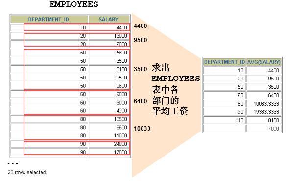
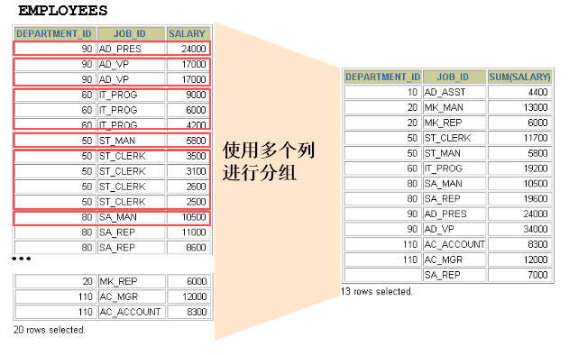

# select语句的6大子句

## 1、select 6大子句顺序

select语句有6大子句：
(1)from子句
(2)where子句
(3)group by子句
(4)having子句
(5)order by子句
(6)limit子句

> **强调：每一个select的6大子句的顺序是(1)-(6)**

1. 关键字的顺序是不能颠倒的：

```mysql
SELECT ... FROM ... WHERE ... GROUP BY ... HAVING ... ORDER BY ...
```

2. SELECT 语句的执行顺序（在 MySQL 和 Oracle 中，SELECT 执行顺序基本相同）：

```mysql
FROM > WHERE > GROUP BY > HAVING > SELECT 的字段 > DISTINCT > ORDER BY > LIMIT

```

比如你写了一个 SQL 语句，那么它的关键字顺序和执行顺序是下面这样的：

```mysql
SELECT DISTINCT player_id, player_name, count(*) as num # 顺序 5
FROM player JOIN team ON player.team_id = team.team_id # 顺序 1
WHERE height > 1.80 # 顺序 2
GROUP BY player.team_id # 顺序 3
HAVING num > 2 # 顺序 4
ORDER BY num DESC # 顺序 6
LIMIT 2 # 顺序 7
```


(1)from子句，后面跟表，视图，多行多列的二维表的结构
     from意思从哪里筛选数据  哪个表哪个视图等
(2)where子句：后面跟条件
     where意思取那几行，要哪些行
(3)group by：后面跟字段
     group by意思是分组
     
 select 结果字段列表
 from 表名称
 where 条件
 group by 分组字段列表;
 要求： 结果字段列表中不要出现和分组无关的字段

```mysql

#查询每个部门的人数
SELECT did,COUNT(*) 
FROM t_employee
GROUP BY did

/*
以下代码，语法不报错，但是语义有问题
建议、要求：分组查询的结果的字段列表中不要出现和分组无关的字段
*/
SELECT ename,did,COUNT(*) 
FROM t_employee
GROUP BY did

#查询每个部门的平均薪资
SELECT did,AVG(salary)
FROM t_employee
GROUP BY did;

#查询每个部门的最高薪资
SELECT did,MAX(salary)
FROM t_employee
GROUP BY did;

#查询每一个部门的男、女的最高薪资
SELECT did,gender,MAX(salary)
FROM t_employee
GROUP BY did,gender;

#查询每一个部门的男、女的人数
SELECT did,gender,COUNT(salary)
FROM t_employee
GROUP BY did,gender;

#查询每一个部门的薪资高于15000的员工的人数
SELECT did,COUNT(*)
FROM t_employee
WHERE salary > 15000
GROUP BY did;

```


(4)having：后面跟条件
    having：意味着在分组统计结果中再次对统计结果加条件，不是对原表中的记录加条件

having和where的区别：
①where后面不能跟分组函数，having后面可以
②where是用于在原表的记录中筛选，having可以是对原表的筛选，但是更多的是用于对统计结果再加条件

```mysql
#having
#查询每个部门的人数，只显示部门人数超过10人的
/*
select did,count(*)
from t_employee
where COUNT(*) > 10
group by did;

错误代码： 1111
Invalid use of group function
*/
SELECT did,COUNT(*)
FROM t_employee
GROUP BY did
HAVING COUNT(*) > 10

#查询每个部门的男员工的人数，只显示人数超过2人
SELECT did,COUNT(*)
FROM t_employee
WHERE gender = '男'
GROUP BY did
HAVING COUNT(*) > 2
```


(5)order by：后面跟字段或表达式
   order by：排序
   升序：省略asc或加asc
   降序：desc

```mysql
#查询员工姓名和薪资，按照薪资的降序排列
SELECT ename,salary
FROM t_employee
ORDER BY salary DESC

#查询每个部门的员工的人数，按照人数的升序排列
SELECT did,COUNT(*)
FROM t_employee
GROUP BY did
ORDER BY COUNT(*) ASC

#查询每个部门的员工的人数，按照人数的升序排列，如果人数相同，按照did降序排列
SELECT did,COUNT(*)
FROM t_employee
GROUP BY did
ORDER BY COUNT(*) ASC, did DESC


#查询每个部门的男员工的人数，按照部门编号降序排列
SELECT did,COUNT(*)
FROM t_employee
WHERE gender = '男'
GROUP BY did
ORDER BY did DESC

#查询每个部门的男员工的人数，按照部门编号降序排列，显示人数超过1人
SELECT did,COUNT(*)
FROM t_employee
WHERE gender = '男'
GROUP BY did
HAVING COUNT(*)>1
ORDER BY did DESC
```


(6)limit：取几条记录
   limit m,n
   m表示从第几条记录开始取，n表示最多取n条件
   通常用于分页查询

```mysql
/*
limit m,n
m：从第几条开始，第一条，用0表示
n：最多取n条

假设page代表第几页，nums代表每页显示的数量
limit (page-1)*nums ,nums

每页显示10条，第1页  limit (1-1)*10,10  -> limit 0,10
每页显示10条，第2页  limit (2-1)*10,10  -> limit 10,10
每页显示10条，第3页  limit (3-1)*10,10  -> limit 20,10

问？每页显示25条，第5页
limit (5-1)*25, 25
*/

#查询员工表的员工信息，每页显示10条，第1页
SELECT * 
FROM t_employee
LIMIT 0,10

#查询员工表的员工信息，每页显示10条，第2页
SELECT * 
FROM t_employee
LIMIT 10,10

#查询员工表的员工信息，每页显示10条，第1页
SELECT * 
FROM t_employee
LIMIT 20,10
```


（1）from：从哪些表中筛选

（2）where：从表中筛选的条件

（3）group by：分组依据

（4）having：在统计结果中再次筛选

（5）order by：排序

（6）limit：分页

order by：

降序：desc 大到小

升序：用么默认，要么加asc


limit：

limit m,n 

m = （第几页 - 1）*每页的数量

n = 每页的数量


代码示例：

```mysql
#查询每个部门的男生的人数，并且显示人数超过5人的，按照人数降序排列，
#每页只能显示10条，我要第2页
SELECT did,COUNT(*) "人数"
FROM t_employee
WHERE gender = '男'
GROUP BY did
HAVING COUNT(*)>5
ORDER BY 人数 DESC
LIMIT 10,10
```

## 8.2 group by与分组函数



**可以使用GROUP BY子句将表中的数据分成若干组**

```sql
SELECT column, group_function(column)
FROM table
[WHERE	condition]
[GROUP BY	group_by_expression];
```

> **明确：WHERE一定放在FROM后面GROUP BY 前面**

**在SELECT列表中所有未包含在分组函数中的列都应该包含在 GROUP BY子句中**

```sql
SELECT   department_id, AVG(salary)
FROM     employees
GROUP BY department_id ;
```

包含在 GROUP BY 子句中的列不必包含在SELECT 列表中

```sql
SELECT   AVG(salary)
FROM     employees
GROUP BY department_id ;
```

**使用多个列分组**



```sql
SELECT   department_id dept_id, job_id, SUM(salary)
FROM     employees
GROUP BY department_id, job_id ;
```

## 8.3 having与分组函数


```mysql
SELECT   department_id, MAX(salary)
FROM     employees
GROUP BY department_id
HAVING   MAX(salary)>8000 ;
```

having与where的区别？

（1）where是从表中筛选的条件，而having是统计结果中再次筛选

（2）where后面不能加“分组/聚合函数”，而having后面可以跟分组函数

```mysql
#统计部门平均工资高于8000的部门和平均工资
SELECT   department_id, AVG(salary)
FROM     employees
WHERE    AVG(salary) > 8000 #错误
GROUP BY department_id;
```


```mysql
#统计部门平均工资高于8000的部门和平均工资
SELECT   department_id, AVG(salary)
FROM     employees
GROUP BY department_id
HAVING   AVG(salary)>8000 ;
```


order by：

降序：desc

升序：用么默认，要么加asc


limit：

limit m,n 

m = （第几页 - 1）*每页的数量

n = 每页的数量


代码示例：

```mysql
#查询每个部门的男生的人数，并且显示人数超过5人的，按照人数降序排列，
#每页只能显示10条，我要第2页
SELECT did,COUNT(*) "人数"
FROM t_employee
WHERE gender = '男'
GROUP BY did
HAVING COUNT(*)>5
ORDER BY 人数 DESC
LIMIT 10,10
```

