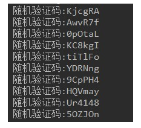

# day19_课后练习题

## 第1题

* 随机验证码。

  * 随机生成十组六位字符组成的验证码。
  * 验证码由大小写字母、数字字符组成。

* 代码实现，效果如图所示：

  

  

* 开发提示：
  * 使用字符数组保存原始字符，利用Random类生成随机索引。
  * 将十组验证码放到集合中
  * 用Iterator迭代器遍历集合

## 第2题

* 键盘录入学生信息，保存到集合中。
  * 循环录入的方式，1：表示继续录入，0：表示结束录入。
  * 定义学生类，属性为姓名，年龄，使用学生对象保存录入数据。
  * 使用ArrayList集合，保存学生对象，录入结束后，用foreach遍历集合。

* 代码实现，效果如图所示：

  

## 第3题

案例：

​	1、用一个String[]数组存点数

​	2、用一个String[]数组存花色

​	3、用一个String[]数组存大王、小王

​	4、用上面的数组，生成一副扑克牌

​	5、遍历显示全副扑克牌

​	6、模拟给4个人随机发牌，每个人11张牌

​	7、显示每个人的牌和剩余的牌

​	效果如下：

## 第4题

* 模拟乐透号码。

  * 随机生成10个号码放到集合中，范围1-50，作为乐透号码。不能重复。
  * 键盘录入10个整数放到集合中，范围1-50，不能重复。
  * 录入的整数与乐透号码对比，统计猜中了几个。

* 代码实现，效果如图所示：

  

开发提示：

* 当使用集合时，可以通过contains方法，判断某集合中是否包含某元素

## 第5题

案例：

​	1、随机生成10个[1,100]之间的整数，放到List集合中，遍历显示

​	2、找出前3名最大值，删除它们，注意可能重复

​	3、显示删除后的结果

​	效果如下：

## 第6题

* 随机生成30个数，范围2-100，获取其中的质数。
* 代码实现，效果如图所示：

开发提示：

* 质数：在一个大于1的整数中，除了1和此整数自身外，没法被其他自然数整除的数。

## 第7题

案例：

​	1、请定义方法public static int listTest(Collection list,String s)统计集合中指定元素出现的次数

​	2、创建集合，集合存放随机生成的30个小写字母

​	3、用listTest统计，某些元素的出现次数

​	4、效果如下

## 第8题

案例：键盘录入一个字符串，去掉其中重复字符，打印出不同的那些字符，必须保证顺序。例如输入：aaaabbbcccddd，打印结果为：abcd。效果如图：

提示：LinkedHashSet的使用

## 第9题

案例：双色球规则：双色球每注投注号码由6个红色球号码和1个蓝色球号码组成。红色球号码从1—33中选择；蓝色球号码从1—16中选择；请随机生成一注双色球号码。（要求同色号码不重复）

开发提示：可以使用TreeSet和ArrayList结合

## 第10题

案例：有如下四个学生的成绩：

（1）用Comparable接口对下列四位同学的成绩做降序排序，如果成绩一样，那在成绩排序的基础上按照年龄由小到大排序。

（2）用Comparator实现按照姓名排序

（3）效果如下

