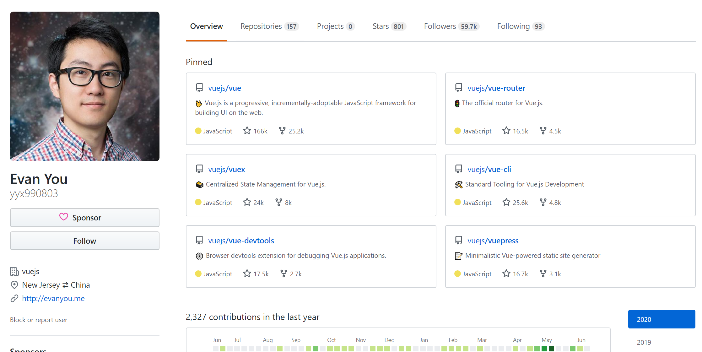
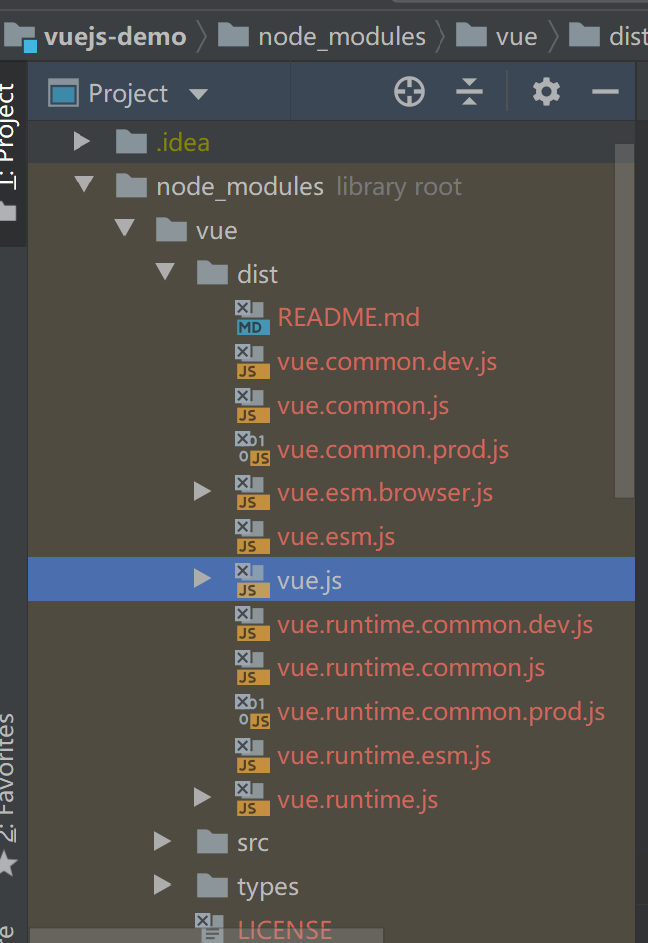

#  Vue

[TOC]

会创建Vue实例，知道Vue的常见属性
会使用Vue的生命周期的钩子函数
能够使用vue常见指令
能够使用vue计算属性和watch监控
能够编写Vue组件
能够使用axios发送异步请求获取数据

## 1. Vue概述

MVVM模式
M：即Model，模型，包括数据和一些基本操作
V：即View，视图，页面渲染结果
VM：即View-Model，模型与视图间的双向操作（无需开发人员干涉）
在MVVM之前，开发人员从后端获取需要的数据模型，然后要通过DOM操作Model渲染到View中。而后当用户操作视图，我们还需要通过DOM获取View中的数据，然后同步到Model中。
而MVVM中的VM要做的事情就是把DOM操作完全封装起来，开发人员不用再关心Model和View之间是如何互相影响的：
只要Model发生了改变，View上自然就会表现出来。
当用户修改了View，Model中的数据也会跟着改变。
把开发人员从繁琐的DOM操作中解放出来，把关注点放在如何操作Model上。

双向操作

Vue概述

认识Vue

Vue (读音 /vjuː/，类似于 view) 是一套用于构建用户界面的渐进式框架。与其它大型框架不同的是，Vue 被设计为可以自底向上逐层应用。Vue 的核心库只关注视图层，不仅易于上手，还便于与第三方库或既有项目整合。另一方面，与现代化的工具链以及各种支持类库结合使用时，Vue 也完全能够为复杂的单页应用提供驱动。

>  前端框架三巨头：Vue.js、React.js、AngularJS，vue.js以其轻量易用著称，vue.js和React.js发展速度最快。

渐进式：可以选择性的使用该框架的一个或一些组件，这些组件的使用也不需要将框架全部组件都应用；而且用了这些组件也不要求你的系统全部都使用该框架。
官网：https://cn.vuejs.org/  [https://vuejs.org/index.html](https://vuejs.org/index.html) 
参考：https://cn.vuejs.org/v2/guide/ [https://vuejs.org/v2/guide/](https://vuejs.org/v2/guide/)
Git地址：https://github.com/vuejs  [https://github.com/vuejs](https://github.com/vuejs)



尤雨溪，Vue.js 创作者，Vue Technology创始人，致力于Vue的研究开发。


**小结**：

MVVM通过视图与模型的双向绑定，简化前端操作。Vue是一款前端渐进式框架，可以提高前端开发效率。

## 2. 搭建示例工程

下载安装

下载地址：https://github.com/vuejs/vue

下载解压，在dist 可得到vue.js文件。


使用CDN
或者也可以直接使用公共的CDN（内容分发网络）服务：

```
<!-- 开发环境版本，包含了用帮助的命令行警告 -->
<script src="https://cdn.jsdelivr.net/npm/vue/dist/vue.js"></script>
```

or:

```
<!-- 生产环境版本，优化了尺寸和速度 -->
<script src="https://cdn.jsdelivr.net/npm/vue"></script>
```

npm安装(推荐)

```
npm init y
# save 的意思是将模块安装到项目目录下，并在package文件的dependencies节点写入依赖
npm install vue --sure
```

如果执行的时候出现如下错误；那么使用管理员身份进入到项目路径下执行上述命令：


然后就会在项目目录发现一个node_modules目录，并且在下面有一个vue目录。




node_modules是通过npm安装的所有模块的默认位置。
此时再查看package.json，会发现有了变化：
会发现，刚刚安装的vue依赖再这里出现了描述信息。是不是跟pom文件很像？


**目标**：使用IDEA创建示例工程并在工程中通过npm安装下载vue.js

**分析**：

vue是一个前端框架，也是其实是一个js文件；下载vue.js文件并在页面中引入该js文件。

vue.js的下载方式：

- 可以引用在线的vue.js；
- 可以离线下载vue.js；
- npm包资源管理器，可以下载vue.js

**小结**：

使用了npm的方式安装vue模块：

```sh
#初始化
npm init -y

#下载vue模块
npm install vue --save
```


## 3. 演示双向绑定与事件处理

vue入门案例

Vue实例

vue渲染

**目标**：创建01-demo.html页面并初始化Vue实例，通过console修改Vue数据实现双向绑定效果和创建按钮实现点击即自增

双向绑定效果 创建按钮实现点击即自增 事件处理

v-model   `v-on:click="num++"`

**分析**：

1. 创建页面，初始化vue；
2. {{}}获取显示数据；
3. v-model实现双向绑定；
4. v-on演示事件处理

**小结**：

```html
<!DOCTYPE html>
<html lang="en">
<head>
    <meta charset="UTF-8">
    <title>Vuejs 测试</title>
    <script src="node_modules/vue/dist/vue.js"></script>
</head>
<body>
<div id="app">
<!--    双向绑定 模型改变影响视图 视图改变影响模型-->
<!--    事件处理-->
    <input type="text" v-model="num"><button v-on:click="num++">点我++</button>
    <h2>{{name}} 非常厉害 精通{{num}}技术。</h2>
</div>
<script type="text/javascript">
    var app = new Vue({
        el:'#app',//el即element，要渲染的页面元素
        data:{
            name:"菜鸡文",
            num:1
        }
    });
</script>
</body>
</html>
```

vue渲染

首先通过 new Vue()来创建Vue实例
然后构造函数接收一个对象，对象中有一些属性：
el：是element的缩写，通过id选中要渲染的页面元素，本例中是一个div
data：数据，数据是一个对象，里面有很多属性，都可以渲染到视图中
name：这里指定了一个name属性
页面中的h2 元素中，通过{{name}}的方式，来渲染刚刚定义的name属性。

更神奇的在于，当你修改name属性时，页面会跟着变化：

双向绑定

在data添加了新的属性： num
在页面中有一个input 元素，通过v-model 与num 进行绑定。
同时通过{{num}} 在页面输出

可以观察到，输入框的变化引起了data中的num的变化，同时页面输出也跟着变化。
input与num绑定，input的value值变化，影响到了data中的num值
页面{{num}} 与数据num绑定，因此num值变化，引起了页面效果变化。
没有任何dom操作，这就是双向绑定的魅力。

事件处理 在页面添加一个按钮：

这里用v-on 指令绑定点击事件，而不是普通的onclick ，然后直接操作num
普通onclick是无法直接操作num的。

效果：

```html
<html lang="en"><head>
    <meta charset="UTF-8">
    <title>Vuejs 测试</title>
    <script src="node_modules/vue/dist/vue.js"></script>
</head>
<body>
<div id="app"><input type="text"><button>点我++</button> <h2>菜鸡文 非常厉害 精通1技术。</h2></div>
<script type="text/javascript">
    var app = new Vue({
        el:'#app',
        data:{
            name:"菜鸡文",
            num:1
        }
    });
</script>

</body></html>
```


## 4. Vue实例生命周期及钩子函数

### 创建Vue实例

每个 Vue 应用都是通过用 Vue 函数创建一个新的 Vue 实例开始的：

```vue
var vm = new Vue({
// 选项
})
```

var vm = new Vue({

​	xxx                                                                                                                                                                               

})

用Vue函数创建一个新的Vue实例开始i的 

在构造函数中传入一个对象，并且在对象中声明各种Vue需要的数据和方法，包括：
el
data
methods
...

接下来一 一介绍。

### el模板或元素

每个Vue实例都需要关联一段Html模板，Vue会基于此模板进行视图渲染；可以通过el属性来指定。

关联一段html模板 进行视图渲染 el属性来指定 

例如一段html模板：

```html
<div id="app">
    
</div>
```

然后创建Vue实例，关联这个div

```html
<script>
	var vm = new Vue({
		el:"#app"
})
</script>    
```

`#  id `  id选择器   id="app"   el:"#app“  

这样，Vue就可以基于id为app 的div元素作为模板进行渲染了。在这个div范围以外的部分是无法使用vue特性的。

数据

当Vue实例被创建时，它会尝试获取在data中定义的所有属性，用于视图的渲染，并且监视data中的属性变化，当data发生改变，所有相关的视图都将重新渲染，这就是“响应式“系统。
html：

```html
<div id="app">
<input type="text" v-model="name"/>
</div>
```

js:

```vue
   var vm = new Vue({
        el:"#app",
        data:{
            name:"菜鸡文"
        }
    })
```


name的变化会影响到input 的值
input中输入的值，也会导致vm中的name发生改变

方法

Vue实例中除了可以定义data属性，也可以定义方法，并且在Vue的作用范围内使用。
html:

```html
<div id="app">
<button v-on:click="add">点我哦</button>
</div>
```

js:

```vue
<script type="text/javascript">
    var vm = new Vue({
        el: "#app",
        data: {},
        methods: {
            add: function () {
                console.log("点我了...233")
            }
        }
    })
```


**目标**：了解Vue实例生命周期，生命周期的钩子函数及created函数常用场景

**分析**：

在创建vue实例的时候可以指定模板id、数据和方法；而如果要在实例化、模板渲染的过程中需要执行一些其它操作的话；那么可以使用钩子函数。

生命周期钩子

生命周期

每个 Vue 实例在被创建时都要经过一系列的初始化过程 ：创建实例，装载模板，渲染模板等。Vue为生命周期中的
每个状态都设置了钩子函数（监听函数）。每当Vue实例处于不同的生命周期时，对应的函数就会被触发调用。

>所有的生命周期钩子自动绑定 this 上下文到实例中，因此你可以访问数据，对属性和方法进行运算。这意味着你不能使用箭头函数来定义一个生命周期方法 (例如 created: () => this.fetchTodos() )。这是因为箭头函数绑定了父上下文，因此 this 与你期待的 Vue 实例不同， this.fetchTodos 的行为未定义。

钩子函数

例如：created代表在vue实例创建后；
可以在Vue中定义一个created函数，代表这个时期的构造函数：
创建示例html页面02-lifecycle.html如下：

```html
<!DOCTYPE html>
<html lang="en">
<head>
    <meta charset="UTF-8">
    <title>vuejs测试</title>
    <script src="node_modules/vue/dist/vue.js"></script>
</head>
<body>
<div id="app">
    {{msg}}
</div>
<script>
    let app = new Vue({
        el:"#app",
        data:{
//初始化为空
            msg:""
        },
        created(){
            this.msg = "hello vue. created";
        }
    });
</script>
</body>
</html>
```

this

可以看下在vue内部的this变量是谁，在created的时候，打印this

```vue
    let vm = new Vue({
        el:"#app",
        data:{
//初始化为空
            msg:""
        },
        created(){
            this.msg = "hello vue. created";
            console.log(this);
        }
    })
```

控制台的输出

总结： this 就是当前的Vue实例，在Vue对象内部，必须使用this 才能访问到Vue中定义的data内属性、方法等。


**小结**：

钩子函数会在vue实例的各个生命周期阶段自动调用；具体有：beforeCreate，created,beforeMount,mounted,updated,beforeUpdate，destroyed，beforeDestroy

created钩子函数常用场景：用于初始化数据

> 钩子函数不要使用箭头函数的方式编写。

## 5. 插值、v-text和v-html

**目标**：插值使用场景和要求；v-text和v-html的作用

**小结**：

**插值**可以使用在有需要显示vue实例数据的地方，可以在插值表达式中调用实例的数据属性和函数。

v-text和v-html的作用：可以将数据在模板中进行显示；**区别**：v-html会对内容中出现的html标签进行渲染，而v-text会将内容当做普遍文本输出到元素里面。

## 6. 指令-v-model使用

**目标**：使用v-model指令实现复选框的双向绑定

**小结**：

```html
<div id="app">
    <input type="checkbox" value="Java" v-model="language">Java<br>
    <input type="checkbox" value="Python" v-model="language">Python<br>
    <input type="checkbox" value="Swift" v-model="language">Swift<br>
    <h2>
        你选择了：{{language.join("，")}}
    </h2>
</div>
<script type="text/javascript">
    var app = new Vue({
        el:"#app",
        data:{
            language:[]
        }
    });
</script>

```

>多个 checkbox 对应一个model时，model的类型是一个数组，单个checkbox值是boolean类型
>radio对应的值是input的value值
>input 和 textarea 默认对应的model是字符串
>select 单选对应字符串，多选对应也是数组

## 7. 指令-v-on使用

**目标**：了解v-on指令的语法实现按钮点击后的递增和递减

**分析**：

在没有使用vue之前；页面标签可以通过设置onXXX响应事件；在vue中可以通过v-on指令响应事件。

**小结**：

v-on的使用：

```html
<div id="app">
    <button v-on:click="num++">增加</button>
    <button @click="decrement">减少</button>
    <h2>
        num = {{num}}
    </h2>
    <hr>
    事件冒泡测试：<br>
    <div style="background-color: lightblue; width:100px;height:100px" @click="print('div被点击了')">
        <button @click.stop="print('点击了button')">点我试试</button>
    </div>
    <br>阻止默认事件：<br>
    <a href="http://www.itcast.cn" @click.prevent="print('点击了超链接')" >传智播客</a>
</div>
<script type="text/javascript">
    var app = new Vue({
        el:"#app",
        data:{
            num:1
        },
        methods: {
            //递减
            decrement(){
                this.num--;
            },
            //打印
            print(str){
                console.log(str);
            }
        }
    });
</script>
```

**事件修饰符**：语法v-on:xxxx.修饰符，常用的修饰符有：

.stop ：阻止事件冒泡
.prevent ：阻止默认事件发生
.capture ：使用事件捕获模式
.self ：只有元素自身触发事件才执行。（冒泡或捕获的都不执行）
.once ：只执行一次

## 8. 指令v-for使用

**目标**：了解v-for指令语法实现对数组、对象的遍历

**分析**：

实现：可以在vue实例化的时候指定要遍历的数据，然后通过v-for指令在模板中遍历显示数据。一般情况下，要遍历的数据可以通过钩子函数created发送异步请求获取数据。

**小结**：

可以使用v-for遍历数组、对象：

```html
<div id="app">
    <ul>
        <li v-for="(user, index) in users" :key="index">
            {{index}}--{{user.name}}--{{user.age}}--{{user.gender}}
        </li>
    </ul>
    <hr>
    <ul>
        <li v-for="(value, key, index) in person">
            {{index}}--{{key}}--{{value}}
        </li>
    </ul>

</div>
<script type="text/javascript">
    var app = new Vue({
        el:"#app",
        data:{
            users:[
                {"name":"黑马","age":13,"gender":"男"},
                {"name":"传智播客","age":13,"gender":"女"},
                {"name":"酷丁鱼","age":4,"gender":"男"}
            ],
            person:{"name":"传智汇","age":13,"gender":"男","address":"中国"}
        }
    });
</script>

```

> 如果遍历的时候需要使用到索引号，可以在循环遍历的位置，添加一个参数；该索引号是从0开始的。

## 9. 指令-v-if和v-show使用

**目标**：说出v-if与v-show的区别；通过一个按钮的点击，实现遍历数组结果的显示存在与否并在遍历过程中使用v-if对数据进行判断处理；实现文本内容的隐藏

**分析**：

- v-if：通过一个按钮的点击，实现遍历数组结果的显示存在与否并在遍历过程中使用v-if对数据进行判断处理
- v-show：实现文本内容的隐藏

**小结**：

v-if在条件不满足的时候元素不会存在；v-show条件不满足的时候只是对元素进行隐藏。

## 10. 指令-v-bind使用

**目标**：了解v-bind语法和作用；实现点击不同按钮切换不同的属性值；使用class属性中的特殊用法实现一个按钮切换背景色

**分析**：

 其中src和height的值如果不想写死，而是想获取vue实例中的数据属性值的话；那可以通过使用v-bind实现：

```html

```

**小结**：

可以使用v-bind：

```html
<div id="app">
    <button @click="color='red'">红色</button>
    <button @click="color='blue'">蓝色</button>
    <div :class="color">
        点击按钮改变背景颜色
    </div>
    <hr>
    <br>
    <button @click="bool=!bool">点我改变下面色块的颜色</button>
    <div :class="{red:bool, blue:!bool}">
        点击按钮改变背景颜色
    </div>
</div>
<script type="text/javascript">
    var app = new Vue({
        el:"#app",
        data:{
            color:"red",
            bool:true
        }
    });
</script>

```

> v-bind的作用：可以对所有元素的属性设置vue实例的数据。

## 11. 计算属性的使用

**目标**：计算属性的应用场景，实现将一个日期时间值转换为yyyy-MM-dd格式字符串

**分析**：

一个日期的毫秒值要显示为格式化（yyyy-MM-dd）的日期字符串的话；可以使用computed计算属性里面的方法进行处理。

**小结**：

计算属性的应用：

```html
<div id="app">
    <h2>
        你的生日是：
        {{new Date(birthday).getFullYear()}}-{{new Date(birthday).getMonth()+1}}-{{new Date(birthday).getDay()}}
    </h2>
    <hr>
    <h2>
        你的生日是：
        {{birth}}
    </h2>
</div>
<script type="text/javascript">
    var app = new Vue({
        el:"#app",
        data:{
            birthday:1429032123201
        },
        computed:{
            birth(){
                const date = new Date(this.birthday);
                return date.getFullYear() + "-" + (date.getMonth()+1) + "-" + date.getDay();
            }
        }
    });
</script>

```

computed计算属性的应用场景：可以应用在插值或者指令表示式复杂的时候。可以将一些属性数据经过方法处理之后返回。

## 12. watch基本和深度监控

**目标**：watch的使用场景；并使用其监听简单属性值及其对象中属性值的变化

**分析**：

在vue实例中数据属性；因为在页面中修改而产生了变化；可以通过watch监控获取其改变前后的值。

如果是修改的对象数据属性，可以开启深度监控获取修改后最新的对象数据。如：person.name

**小结**：

可以如下使用watch进行数据属性的监控：

```html
<div id="app">
    <input type="text" v-model="message">
    <hr><br>
    <input type="text" v-model="person.name"><br>
    <input type="text" v-model="person.age"><button @click="person.age++">+</button>
    <h2>
        姓名为：{{person.name}}；年龄为：{{person.age}}
    </h2>
</div>
<script type="text/javascript">
    var app = new Vue({
        el:"#app",
        data:{
            message:"黑马",
            person:{"name":"heima", "age":13}
        },
        watch:{
            message(newValue, oldValue){
                console.log("新值：" + newValue + "；旧值：" + oldValue);
            },
            person: {
                //开启深度监控；监控对象中的属性值变化
                deep: true,
                //可以获取到最新的对象属性数据
                handler(obj){
                    console.log("name = " + obj.name + "; age=" + obj.age);
                }
            }
        }
    });
</script>

```

watch使用场景：可以监控视图中数据的变化而做出响应；如：下拉框列表中，当如果选择了对于的下拉框选项之后，要根据最新的值去加载一些其它数据的话。

## 13. 组件使用

**目标**：了解组件的使用场景；定义点击则计数的组件并使用全局注册和局部注册方式

**分析**：

可以将通用或者公用的页面模块抽取成vue组件，在vue实例中引用。

**小结**：

在页面中可以如下实验组件：

```html
<div id="app">
    <!--使用组件-->
    <counter></counter>
    <counter></counter>
    <counter></counter>
</div>
<script type="text/javascript">

    //定义组件
    const counter = {
        template:"<button @click='num++'>你点击了{{num}}次</button>",
        data(){
            return {num:0}
        }
    };

    //全局注册组件：在所有的vue实例中都可以使用组件
    //参数1：组件名称，参数2：具体的组件
    //Vue.component("counter", counter);

    var app = new Vue({
        el:"#app",
        components:{
            counter: counter
        }
    });
</script>

```

组件使用场景：在项目需要重用某个模块（头部、尾部、新闻。。。）的时候，可以将模块抽取成组件，其它页面中注册组件并引用。

- 全局注册：在任何vue实例中都可以引用，如：一般网站的头部导航菜单
- 局部注册：可以在有需要的页面引入组件，如：商城网站首页页面中各种活动模块

## 14. 父组件向子组件通信

**目标**：父组件与子组件通信的意义；实现父组件将简单字符串和对象更新到子组件

**小结**：

组件通信意义：父子组件之间数据的交换，能够及时更新组件内容。

- 父组件将简单字符串更新传递到子组件

```html
<div id="app">
    <!--使用组件-->
    <introduce :title="msg"></introduce>
</div>
<script type="text/javascript">

    //定义组件
    const introduce = {
        template:"<h2>{{title}}</h2>",
        //定义接收父组件的属性
        props:["title"]
    };

    //全局注册组件：在所有的vue实例中都可以使用组件
    //参数1：组件名称，参数2：具体的组件
    Vue.component("introduce", introduce);

    var app = new Vue({
        el:"#app",
        data:{
            msg:"父组件的msg属性数据内容"
        }
    });
</script>

```


- 父组件将数组更新传递到子组件

```html
<div id="app">
    <!--使用组件-->
    <my-list :items="lessons" ></my-list>
</div>
<script type="text/javascript">

    //定义组件
    const myList = {
        template:`
            <ul>
            <li v-for="item in items" :key="item.id">{{item.id}}--{{item.name}}</li>
</ul>
        `,
        //定义接收父组件的属性
        props:{
            items:{
                //数据类型，如果是数组则是Array，如果是对象则是Object
                type:Array,
                //默认值
                default:[]
            }
        }
    };

    var app = new Vue({
        el:"#app",
        data:{
            msg:"父组件的msg属性数据内容",
             :[
                {"id":1, "name":"Java"},
                {"id":2, "name":"Php"},
                {"id":3, "name":"前端"}
            ]
        },
        components:{
            myList
        }
    });
</script>

```


## 15. 子组件向父组件通信

**目标**：在子组件中点击对应按钮实现父组件中属性数据的改变

**小结**：

```html
<div id="app">
    <h2>num = {{num}}</h2>
    <!--使用组件-->
    <counter @plus="numPlus" @reduce="numReduce" :snum="num"></counter>
</div>
<script type="text/javascript">

    //定义组件
    const counter = {
        template:`
            <div>
            <button @click='incrNum'>+</button>
            <button @click='decrNum'>-</button>
            </div>
        `,
        props:["snum"],
        methods:{
            //递增
            incrNum(){
                //调用到父组件中的方法
                return this.$emit("plus");
            },
            decrNum(){
                //调用到父组件中的方法
                return this.$emit("reduce");
            }
        }
    };

    //全局注册组件：在所有的vue实例中都可以使用组件
    //参数1：组件名称，参数2：具体的组件
    //Vue.component("counter", counter);

    var app = new Vue({
        el:"#app",
        components:{
            counter: counter
        },
        data:{
            num:0
        },
        methods:{
            numPlus(){
                this.num++;
            },
            numReduce(){
                this.num--;
            }
        }
    });
</script>

```


## 16. axios概述

**目标**：axios的用途及了解常见方法

**小结**：

axios的作用：**发送异步请求获取数据**。常见的方法：**get、post**；在发送的时候可以指定参数（地址、请求方式和请求头部信息）；返回数据结构（**data**/status/statusText/headers/config）

## 17. axios方法及get、post方法使用

**目标**：使用axios方法获取数据并在页面中将数据遍历显示；切换改为get/post方法实现数据加载

**小结**：

可以使用axios获取对应服务器数据；如果不是同一个服务的数据则可能会出现跨域请求；需要在响应的服务器上配置跨域。

```html
<!DOCTYPE html>
<html lang="en">
<head>
    <meta charset="UTF-8">
    <title>vuejs测试</title>
    <script src="node_modules/vue/dist/vue.js"></script>
    <script src="js/axios.min.js"></script>
</head>
<body>
<div id="app">
    <ul>
        <li v-for="(user, index) in users" :key="index">
            {{index}}--{{user.name}}--{{user.age}}--{{user.gender}}
        </li>
    </ul>

</div>
<script type="text/javascript">
    var app = new Vue({
        el:"#app",
        data:{
            users:[]
        },
        created(){
            //初始化加载数据
            axios.post("data.json").then(res=>{
                console.log(res);
                //将数据赋值到vue实例中的数据属性users；
                //不能使用this，在axios回调函数中表示窗口，不是vue实例
                app.users = res.data;
            }).catch(err=>alert(err));

            axios.get("http://localhost/user/8").then(res=>{
                console.log(res.data);
            }).catch(err=>alert(err));
/*
            axios.get("data.json").then(res=>{
                console.log(res);
                //将数据赋值到vue实例中的数据属性users；
                //不能使用this，在axios回调函数中表示窗口，不是vue实例
                app.users = res.data;
            }).catch(err=>alert(err));
*/
/*
            axios({
                url:"data.json",
                method:"get"
            }).then(res=>{
                console.log(res);
                //将数据赋值到vue实例中的数据属性users；
                //不能使用this，在axios回调函数中表示窗口，不是vue实例
                app.users = res.data;
            }).catch(err=>alert(err));
*/
        }
    });
</script>
</body>
</html>
```


> 跨域：在前端js中如果发送异步请求的话，请求的地址与当前服务器的ip或者端口号不同都是跨域请求，可以使用如下方式在服务器端进行配置：


