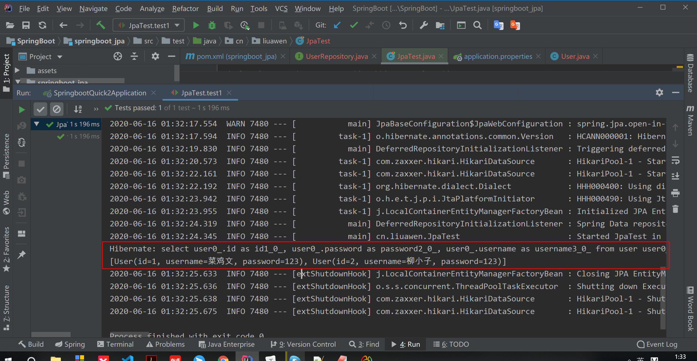

# SpringBoot整合Spring Data JPA

[TOC]

使用JPA操作数据库

JPA是Java Persistence API的简称，是JCP组织发布的Java EE标准之一。JPA是一种面向对象的查询语言，定义了独特的JPQL（Java Persistence Query Language），是一种针对实体的查询语言，无论是查询还是修改，全部操作的都是对象实体，而非数据库的表。


# 添加Spring Data JPA的起步依赖

JPA依赖配置

新建项目，在pom文件中加入JPA依赖

```xml
<dependency>
            <groupId>org.springframework.boot</groupId>
            <artifactId>spring-boot-starter-data-jpa</artifactId>
</dependency>
```


# 添加数据库驱动依赖

在pom文件中加入MySQL依赖

```xml
<!-- MySQL连接驱动 -->
<dependency>
    <groupId>mysql</groupId>
    <artifactId>mysql-connector-java</artifactId>
</dependency>
```


# 在application.properties中配置数据库和jpa的相关属性

在配置文件中加入数据库配置

JPA的基本配置介绍

* validate：在加载hibernate时，验证创建数据库表结构。
* create：每次加载hibernate，重新创建数据库表结构，设置时要注意，如果设置错误的话，就会造成数据的丢失。
* create-drop：在加载的时候创建表，在关闭项目时删除表结构。
* update：加载时更新表结构。
* none：加载时不做任何操作。
* spring.jpa.show-sql配置  设置为true时，可以在控制台打印SQL。

application.properties 


```properties
#DB Configuration:
#数据库配置

#数据库驱动
spring.datasource.driverClassName=com.mysql.jdbc.Driver
#数据库地址
spring.datasource.url=jdbc:mysql://127.0.0.1:3306/test?useUnicode=true&characterEncoding=utf8&serverTimezone=UTC
#数据库用户名
spring.datasource.username=root
#数据库密码
spring.datasource.password=123456

#JPA Configuration:
#JPA 配置


spring.jpa.database=MySQL
#控制台打印SQL
spring.jpa.show-sql=true
spring.jpa.generate-ddl=true
spring.jpa.hibernate.ddl-auto=update
spring.jpa.hibernate.naming_strategy=org.hibernate.cfg.ImprovedNamingStrategy

```

问题：

Loading class `com.mysql.jdbc.Driver'. This is deprecated. The new driver class is `com.mysql.cj.jdbc.Driver'. The driver is automatically registered via the SPI and manual loading of the driver class is generally unnecessary.

application.properties要改

```properties
#DB Configuration:
#数据库配置

#数据库驱动
spring.datasource.driverClassName=com.mysql.cj.jdbc.Driver
#数据库地址
spring.datasource.url=jdbc:mysql://127.0.0.1:3306/test?useUnicode=true&characterEncoding=utf8&serverTimezone=UTC
#数据库用户名
spring.datasource.username=root
#数据库密码
spring.datasource.password=123456

#JPA Configuration:
#JPA 配置


spring.jpa.database=MySQL
#控制台打印SQL
spring.jpa.show-sql=true
spring.jpa.generate-ddl=true
spring.jpa.hibernate.ddl-auto=update
spring.jpa.hibernate.naming_strategy=org.hibernate.cfg.ImprovedNamingStrategy

```

com.mysql.jdbc.Driver  高版本使用 com.mysql.cj.jdbc.Driver 

# 创建实体配置实体

创建一个实体对象，在类上加入注解@Entity来表明这是一个实体类，

在属性上使用@Id表明这是数据库中的主键ID，使用@GeneratedValue(strategy = GenerationType.IDENTITY)表明此字段自增长，在属性上加入@Column(nullable = false,unique = true)可以设置字段的一些属性，比如nullable为非空、unique唯一约束，还提供了其他属性等等。


User.java

```java
package cn.liuawen.domain;

import lombok.Data;

import javax.persistence.Entity;
import javax.persistence.GeneratedValue;
import javax.persistence.GenerationType;
import javax.persistence.Id;

@Entity
@Data
public class User {
    // 主键
    @Id
    @GeneratedValue(strategy = GenerationType.IDENTITY)
    private Long id;
    // 用户名
    private String username;
    // 密码
    private String password;
}

```


# 编写UserRepository

创建数据操作层

新建一个repository接口，使其继承JpaRepository，这个接口默认提供一组与JPA规范相关的方法

UserRepository.java

```java
package cn.liuawen.repository;

import cn.liuawen.domain.User;
import org.springframework.data.jpa.repository.JpaRepository;

import java.util.List;


//实体、类型
public interface UserRepository  extends JpaRepository<User,Long> {
    public List<User> findAll();
}

```

来分析一波

UserRepository 继承  JpaRepository<User,Long>  那JpaRepository<T, ID>是什么

```java
//
// Source code recreated from a .class file by IntelliJ IDEA
// (powered by Fernflower decompiler)
//

package org.springframework.data.jpa.repository;

import java.util.List;
import org.springframework.data.domain.Example;
import org.springframework.data.domain.Sort;
import org.springframework.data.repository.NoRepositoryBean;
import org.springframework.data.repository.PagingAndSortingRepository;
import org.springframework.data.repository.query.QueryByExampleExecutor;

@NoRepositoryBean
public interface JpaRepository<T, ID> extends PagingAndSortingRepository<T, ID>, QueryByExampleExecutor<T> {
    List<T> findAll();

    List<T> findAll(Sort var1);

    List<T> findAllById(Iterable<ID> var1);

    <S extends T> List<S> saveAll(Iterable<S> var1);

    void flush();

    <S extends T> S saveAndFlush(S var1);

    void deleteInBatch(Iterable<T> var1);

    void deleteAllInBatch();

    T getOne(ID var1);

    <S extends T> List<S> findAll(Example<S> var1);

    <S extends T> List<S> findAll(Example<S> var1, Sort var2);
}

```


从源代码中可以看到，默认为我们提供了很多简单的方法，如findAll()、getOne()等，而JpaRepository则继承了PagingAndSortingRepository接口。PagingAndSortingRepository接口代码其代码如下所示。

```java
//
// Source code recreated from a .class file by IntelliJ IDEA
// (powered by Fernflower decompiler)
//

package org.springframework.data.repository;

import org.springframework.data.domain.Page;
import org.springframework.data.domain.Pageable;
import org.springframework.data.domain.Sort;

@NoRepositoryBean
public interface PagingAndSortingRepository<T, ID> extends CrudRepository<T, ID> {
    Iterable<T> findAll(Sort var1);

    Page<T> findAll(Pageable var1);
}

```

PagingAndSortingRepository接口继承了CrudRepository接口，实现了有关分页排序等相关的方法，其代码如下所示。


```java
//
// Source code recreated from a .class file by IntelliJ IDEA
// (powered by Fernflower decompiler)
//

package org.springframework.data.repository;

import java.util.Optional;

@NoRepositoryBean
public interface CrudRepository<T, ID> extends Repository<T, ID> {
    <S extends T> S save(S var1);

    <S extends T> Iterable<S> saveAll(Iterable<S> var1);

    Optional<T> findById(ID var1);

    boolean existsById(ID var1);

    Iterable<T> findAll();

    Iterable<T> findAllById(Iterable<ID> var1);

    long count();

    void deleteById(ID var1);

    void delete(T var1);

    void deleteAll(Iterable<? extends T> var1);

    void deleteAll();
}

```

CrudRepository接口继承了Spring Data JPA的核心接口Repository，实现了有关CRUD相关的方法（增、删、改、查）。在Repository接口中没有提供任何方法，仅仅作为一个标识来让其他类实现它作为仓库接口类，其代码如代码所示。

```java
//
// Source code recreated from a .class file by IntelliJ IDEA
// (powered by Fernflower decompiler)
//

package org.springframework.data.repository;

import org.springframework.stereotype.Indexed;

@Indexed
public interface Repository<T, ID> {
}

```

除了Repository接口以外，其余接口都含有一个@NoRepositoryBean注解，加入这个注解的类，Spring就不会实例化，用作父类的Repository。

# 编写测试类

简单测试运行

```java
package cn.liuawen;

import cn.liuawen.domain.User;
import cn.liuawen.repository.UserRepository;
import org.junit.Test;
import org.junit.runner.RunWith;
import org.springframework.beans.factory.annotation.Autowired;
import org.springframework.boot.test.context.SpringBootTest;
import org.springframework.test.context.junit4.SpringRunner;

import java.util.List;


@RunWith(SpringRunner.class)
@SpringBootTest(classes = SpringbootJpaApplication.class)
public class JpaTest {
    @Autowired
    private UserRepository userRepository;

    @Test
    public void test1(){
        List<User> users = userRepository.findAll();
        System.out.println(users);
    }
}

```

在使用JPA操作数据库时，操作特别简单，基本上使用Repository提供的几个方法已经可以满足我们的需求。

满足不了自己写SQL咯

# 控制台打印信息





```
Hibernate: select user0_.id as id1_0_, user0_.password as password2_0_, user0_.username as username3_0_ from user user0_
[User(id=1, username=菜鸡文, password=123), User(id=2, username=柳小子, password=123)]
```


# 参考资料

简单记录 

1、Spring实战（第5版）作者：[美]克雷格·沃斯译者：张卫滨

2、Spring Boot 2实战之旅／杨洋著